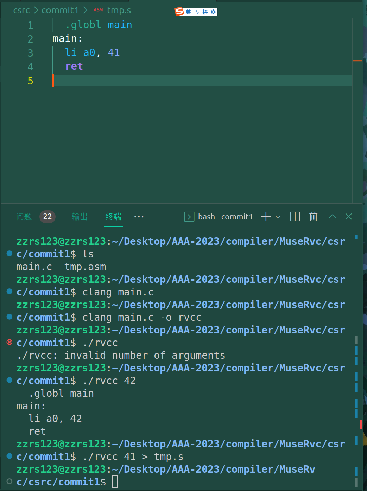
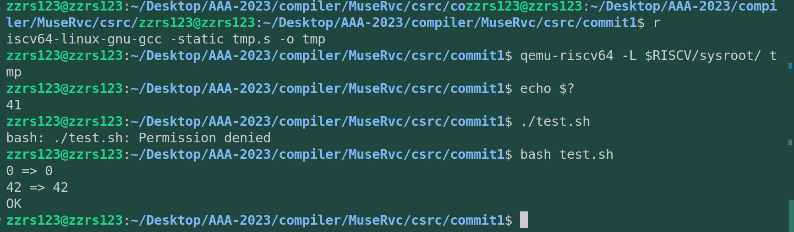
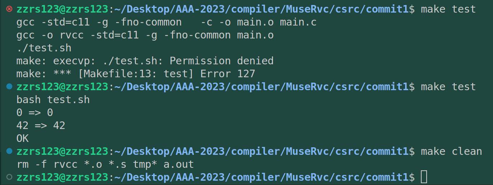
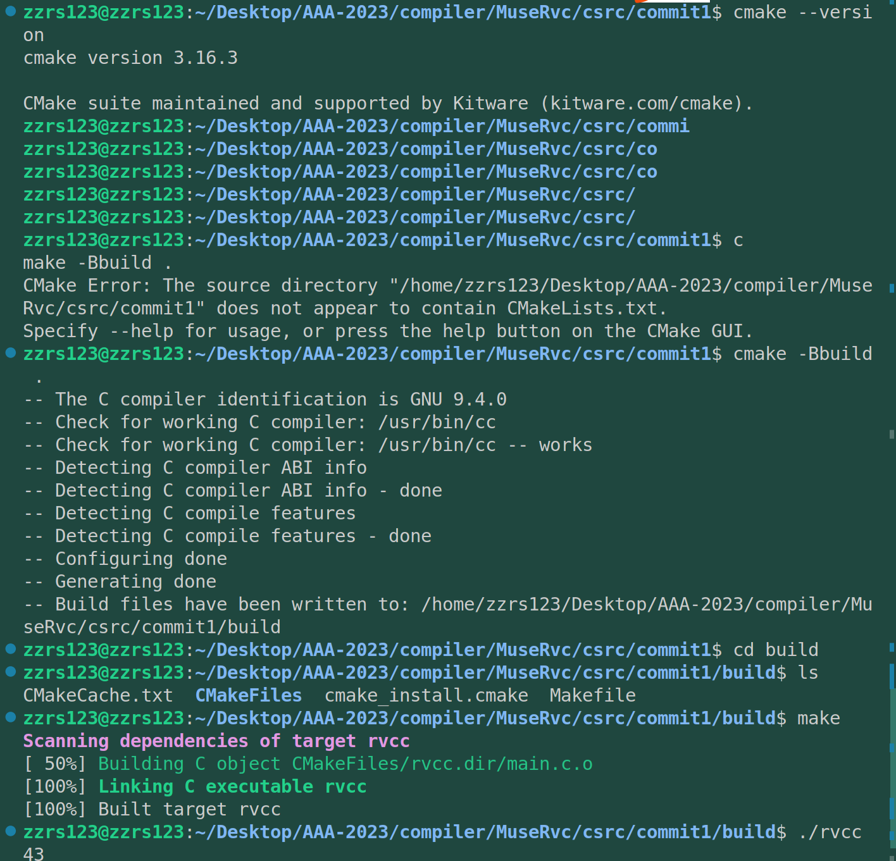

# commit1

## 1. 简介

> 仓库文件结构：csrc是rvcc源码的从零开始实现（C语言）。rsrc是自己用rust语言重写的。

rvcc本身是基于Rui大师的 x86 架构的迷你编译器chibicc，chibicc分316个commits实现了一个能够编译Git级别开源项目的C编译器。

学习rvcc不需要事先掌握编译原理知识（边做边学），但是需要：

* 基本工具的使用：Git、Make、clang/gcc
* C语法，明白指针的用法
* 了解基础数据结构，理解链表用法。

rvcc课程环境：推荐ubuntu20.04（也是我使用的系统）

RISC-V的交叉编译环境：2023-04-19 配置完成，构建riscv-gnu-toolchain的64位Linux库，编译qemu7.0.0（此前Rcore时编译过了）。

> 课程推荐的模拟机有spike、pk、qemu。我是用的是qemu7.0.0。

> - rvcc代码仓库地址：
> - rvcc视频讲解地址：
> - rvcc相关文件地址：
> - chibicc代码仓库地址：

## 2. 编译出能返回特定数值的程序

### 2.1 熟悉交叉编译环境

先是演示一下交叉编译，给了一段RISC-V汇编：

```assembly
# 声明全局的global段
.global main
# main段的开始，也是main标签
main:
    # 42->a0寄存器
    li a0,42
    # a0的值返回给系统调用
    ret
```

编译：（交叉编译配置见文件  `../readmes/rust-riscv-tools.md`）

```bash
# 编译
riscv64-unknown-linux-gnu-gcc -static tmp.s -o tmp 
# 执行
qemu-riscv64 -L $RISCV/sysroot tmp

# 向屏幕显示返回值
echo $?#

# 可以看到输出为：42
```

### 2.2 C文件初试

是在main.c中：注释写的相当详细。

```C
#include <stdio.h>
#include <stdlib.h>

int main(int Argc, char **Argv) {
  // 异常判断
  // 判断传入程序的参数是否为2个，Argv[0]为程序名称，Argv[1]为传入的第一个参数
  if (Argc != 2) {
    // 异常处理，提示参数数量不对。
    // fprintf，格式化文件输出，往文件内写入字符串
    // stderr，异常文件（Linux一切皆文件），用于往屏幕显示异常信息
    // %s，字符串
    fprintf(stderr, "%s: invalid number of arguments\n", Argv[0]);
    // 程序返回值不为0时，表示存在错误
    return 1;
  }

  // 声明一个全局main段，同时也是程序入口段
  printf("  .globl main\n");
  // main段标签
  printf("main:\n");
  // li为addi别名指令，加载一个立即数到寄存器中
  // 传入程序的参数为str类型，因为需要转换为需要int类型，
  // atoi为“ASCII to integer”
  printf("  li a0, %d\n", atoi(Argv[1]));
  // ret为jalr x0, x1, 0别名指令，用于返回子程序
  printf("  ret\n");

  return 0;
}

```

编译截图：



> `./rvcc 41 > tmp.s`是一种管道输出操作，到tmp.s

再编译被修改后的tmp.s（注意上图的ls命令中有一个asm，是因为这里我刚开始创建的是.asm，后面我删除了.asm文件）,下面是再编译以及test.sh脚本测试

> 这个课真好，还顺便学了shell脚本哈哈。



### 2.3 makefile引入

上面每次输入命令都很长，而且一次执行需要多次输入不同命令，可以用makefile及合起来。



然后就讲解makefile，没有特别说明，make会使用makefile的第一个指令，（在此例中是 make rvcc）。还讲解了增量编译的简单逻辑。

### 2.4 CmakeLists引入

CmakeLists类似Makefile，下面我先查看了自己是否安装了cmake以及cmake版本，接着执行CmakeLists，执行输出文件目录是build，待构建文件是当前目录下。

执行后就可以看到生成文件都在build目录里，再进入build目录，运行make，再执行就可以了。



如果想删除生成的文件，也就是实现make clean等价操作，输入 `rm -r build`即可。

## 3. rust 实现

这部分的难点还是交叉编译的rust环境，因为多了个Cargo管理器，跟比较熟悉的C语言还是不太一样的。

> 环境配置见 `../notes/readmes/rust_riscv_tools.md`
