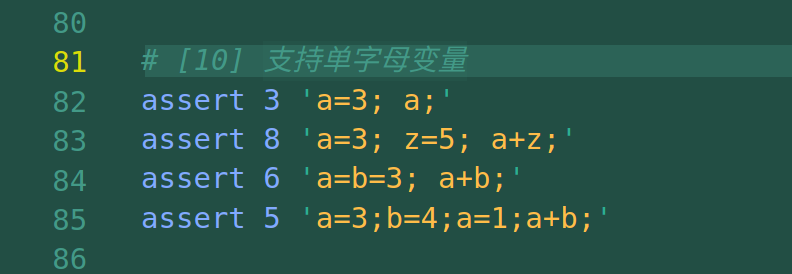
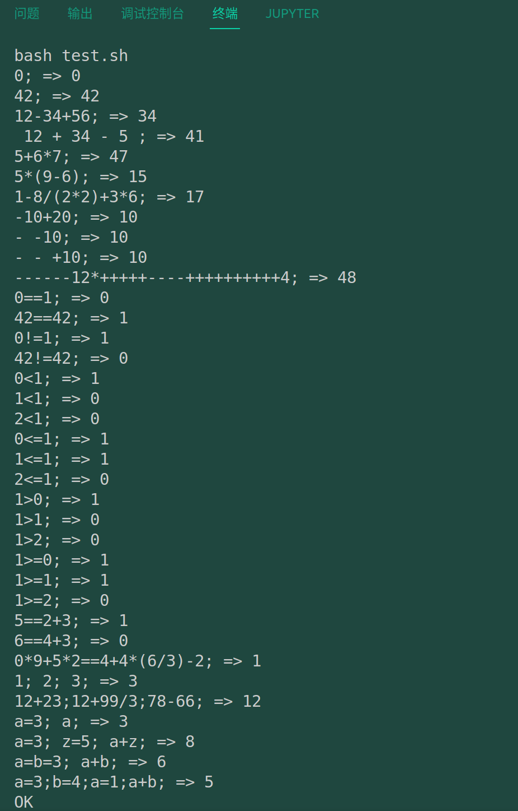
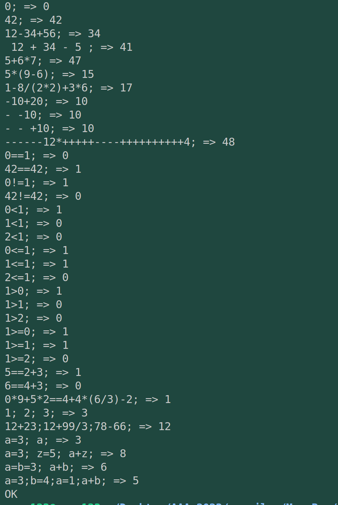

# commit10: 支持单字母本地变量

## 1. C程序功能

test.sh增加如下：

---

make test 运行如下：

---

可见增加的是单字母变量赋值运算，以及递归赋值：比如a=b=3。

## 2. 阅读C程序

### 2.1 词法

增加单字母的解析，解析为变量token。这一点应该类似于数字的解析。实现起来不复杂。

> 想将tokenize函数的每个匹配块封装为子函数。

### 2.2 文法

文法部分则是增加面对变量解析的相应函数，在解析表达式和解析相等性之间增加解析赋值。

**赋值的优先级应当低于相等的判断。这是符合语言特性的。**

### 2.3 代码生成

这部分是大头，甚至有些修改此前我对于codegen的理解，表达式的生成只是代码生成的一部分。

## 3. rust实现

### 3.1 词法

单字母变量，匹配方式和匹配的操作跟数字token基本完全一样，所以也是照着数字token来做的。甚至可以直接一步到位，去解析连着的字母如'aa'。

虽然词法是这样实现的（指实现多字母变量），但是step9：我的文法以及代码生成还是保守一点，按照单字母变量来实现，这样的小步快走可以让我这个caiji更容易把控自己的整个项目。

### 3.2 文法

文法其实还算容易，对于递归向下的思路来说并不难理解。注意赋值要在相等性之前（优先级低），此外primary中增加变量节点的相关内容。生成的效果类似于左变量、中=号、右待赋值的数字。

### 3.3 代码生成

重头戏还是代码生成（此前代码生成都是最简单的一步），加入变量后就需要掌控变量的栈布局，这一点需要分析RISCV的编程模型。在这里犹豫的过程中体会到了变量类型是个什么东西，目前一个变量8个字节。

看看效果：

