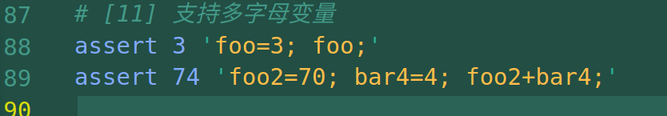
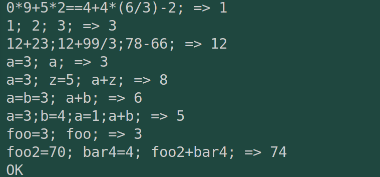
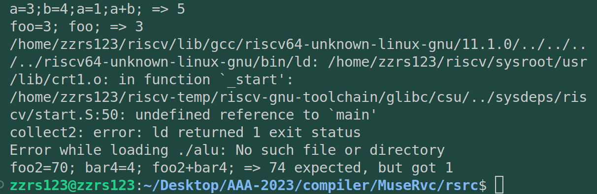
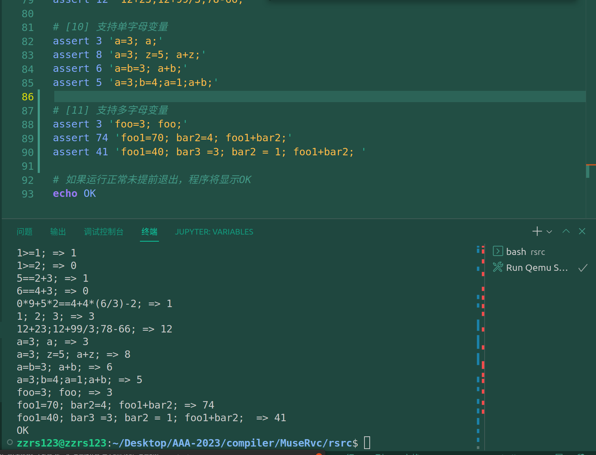

# commit11: 支持多字母本地变量

## 1. C程序功能

首先感觉这部分的实现比我想象的复杂很多，因为变量这个事情本身逻辑就不简单。test.sh测例新增如下：



运行如下：



可见增加的功能类似于C语言中的变量赋值语句与变量运算语句。

## 2. 阅读C程序

### 2.1 头文件 rvcc.h

使用了POSIX标准，所以有如下声明：

```C
// 使用POSIX.1标准
// 使用了strndup函数
#define _POSIX_C_SOURCE 200809L
```

新增加了一个typedef node结构体 node，增加了两个结构体：Obj（变量）和 Function（函数）

> 单纯读体会不深刻，用rust实现完才觉得Function与Node不是平级，而是Function是Node的统帅。后续可能还会有统领Functiion的结构体比如Scope？

### 2.2 词法:tokenize.c

Rust相对C语言的函数库比较多，识别多字母变量只需以下代码（不需要手撸）：

```rust
 // 解析字母（变量），同时预留了多字母变量的支持
            'a'..='z' | 'A'..='Z' | '_'  => {
                let mut end = i;
                while let Some(c) = arg.chars().nth(end) {
                    if c.is_ascii_alphabetic() || c.is_ascii_digit() || c == '_' {
                        end += 1;
                    } else {
                        break;
                    }
                }
                let ident = &arg[start..end];
                let token = Token {
                    kind: TokenKind::TkIdent,
                    value: Some(V::Str(ident)),
                    loc: i,
                    len: end - start,
                };
                tokens.push(token);
                start = end;
            }
```

### 2.3 文法:parse.c

文法并没有增加太多，只是修改了primary中的变量处理逻辑，必须考虑解析到的token变量是否之前已经出现过了，如果出现过，就应该拿之前的变量继续运算（作用域还没有考虑进来，默认同一作用域）。如果没有，则运算的同时需要将它记录下来。

### 2.4 生成:codegen

**step10重头戏就是管理变量的栈。**

## 3. Rust实现

commit10的实现中，已经可以通过commit11的第一个测试用例，第二个会报错：



所以tokenize-lexer应该简单调整一下就可以。主要还是文法跟代码生成。

### 3.1 词法

需要根据C语言的变量的要求来处理lexer中的token流。

C语言变量允许用 小写/大写字母/下划线_来开头，后续可以是若干小写/大写字母、数字、下划线。所以在commit10单纯处理小写字母的基础上进行简单调整即可。

> 2023/05/10补充：无法解析变量中的（非开头）数字，发现词法写的不对。已经修正。

### 3.2 文法

这部分比较复杂，复杂在于此前一直在自我怀疑的代码框架的问题，无法使用类C风格在rust中便捷的使用全局链表（更倾向于结构体及其impl）。目前使用了Function结构体，在它的impl中放置 find_local_var 和 add_local_var等变量管理方法。

而后续我的设想是这样，增加Parser结构体，将parser.rs整体struct+impl化。

```rust
#[derive(Debug, PartialEq, Clone)]
pub struct Obj {
    pub(crate) next: Option<Box<Obj>>,
    name: String,
    offset: i32,
}

impl Obj {
    pub fn new(name: String, offset: i32) -> Self {
        Obj {
            next: None,
            name,
            offset,
        }
    }
}

pub struct Function {
    pub name: String,
    pub body: Option<Box<Node>>,
    pub locals: Option<Box<Obj>>,  // 本地变量列表
    pub stack_size: i32,
}

pub struct Parser {
    scopes: Vec<Option<Box<Obj>>>,  // 作用域栈
}

impl Parser {
    pub fn new() -> Self {
        Parser { scopes: vec![None] }
    }

    pub fn push_scope(&mut self, locals: Option<Box<Obj>>) {
        self.scopes.push(locals);
    }

    pub fn pop_scope(&mut self) -> Option<Box<Obj>> {
        self.scopes.pop().unwrap()
    }

    pub fn find_local(&self, name: &str) -> Option<&Obj> {
        for scope in self.scopes.iter().rev() {
            if let Some(obj) = scope {
                if obj.name == name {
                    return Some(obj);
                }
            }
        }
        None
    }

    pub fn insert_local(&mut self, name: String, offset: i32) {
        let obj = Obj::new(name, offset);
        if let Some(scope) = self.scopes.last_mut() {
            if let Some(head) = scope.take() {
                obj.next = Some(head);
            }
            *scope = Some(Box::new(obj));
        }
    }

    pub fn parse_function(&mut self, name: String, tokens: &[Token]) -> Result<Function, ParseError> {
        let mut function = Function {
            name,
            body: None,
            locals: None,
            stack_size: 0,
        };
        // 解析函数参数列表
        // ...

        // 进入函数作用域
        self.push_scope(function.locals.clone());

        // 解析函数体
        let body = self.parse_statement_block(tokens)?;

        // 退出函数作用域
        let locals = self.pop_scope();
        function.body = Some(Box::new(body));
        function.locals = locals;

        Ok(function)
    }

    fn parse_statement_block(&mut self, tokens: &[Token]) -> Result<Node, ParseError> {
        // 解析语句块
        // ...
    }

    // 其他解析方法
    // ...
}
```


使用 `Obj` 结构体来表示局部变量，可以使用一个 `Vec` 来存储 `Obj` 对象。每个 `Obj` 对象都表示一个局部变量，并包含变量名和在栈帧中的偏移量。遇到一个变量时，搜索该 `Vec`，以查找与变量名匹配的 `Obj` 对象，并获取其偏移量。如果找不到匹配的 `Obj`，则说明该变量未定义。

如果需要处理嵌套的作用域和函数调用等情况，那么locals使用一个 `Vec` 可能不够灵活，可能需要将局部变量存储在一个更复杂的数据结构中，**例如一个 `HashMap`。**

### 3.3 代码生成

代码生成的问题主要是修改与修改未返回。（rust的数据绑定和所有权引发的新的逻辑bug）。

以及自己的数据结构问题很大。我的数据结构设计与遇到的问题、解决办法是：

* Function是核心数据结构，其中body统帅ast树（用于生成语句）、locals变量列表（用于管理变量计算逻辑）。
* codegen中此前一直直接使用ast树进行解析，所以我将每个变量var（obj类型）也放置到了对应类别下的node的var成员中。
* 而codegen在step10中最大的修改就是栈的计算，我根据locals变量的顺序在codegen中计算offset并更新（**这里担心过所有权导致的修改但没有返回的问题**）。
* 但是我忽略了此后我使用offset计算都是用的是body中的ast::Node中的var成员中的offset，所以更新offset是要更新这个offset。（把这个debug报告写出来就能体会我的这个数据结构设计问题很大）
* 所以增加了树的遍历，修改这个offset值。修改之后正确。



## 4. 总结

**这部分虽然相较于step9的功能增加不大（主要是codegen的代码生成没有生成更多语句）。但是实际上对我前面所有的实现的代码架构提出了严重挑战。我开始尝试使用Class的编程方式（在rust中是struct+impl），我觉得这才是类似于C的.h .c的结构平替。**

更重要的是通过对Function结构体的认识，我对后面代码功能的增加，有了更大的信心。（虽然这一步卡了很多天）。
