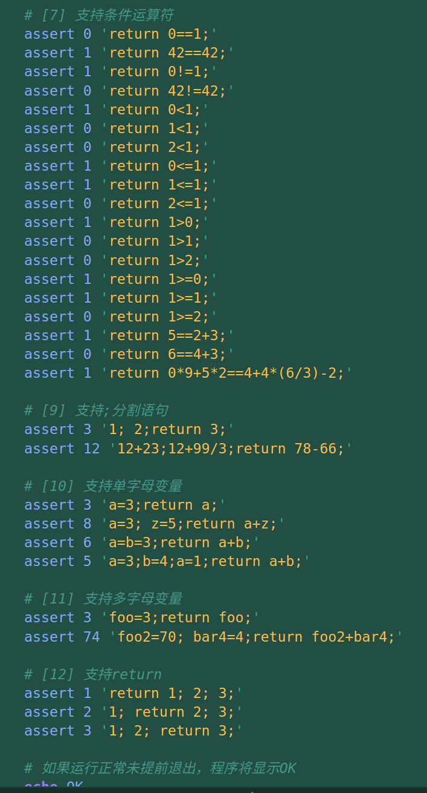
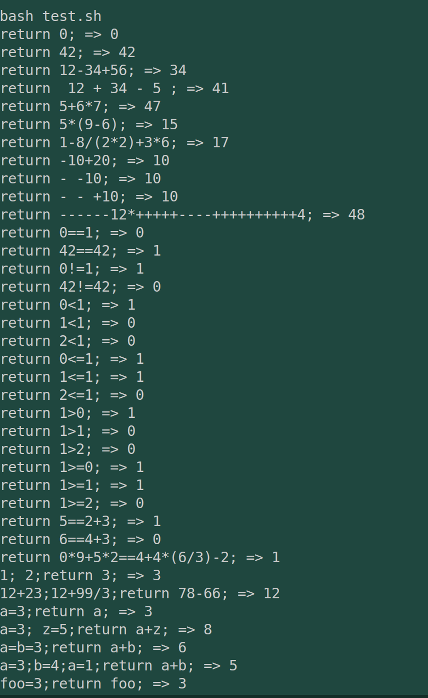
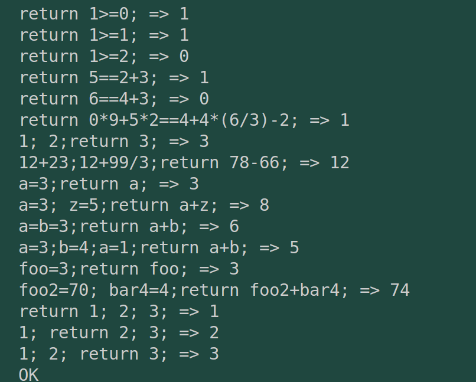

# commit12: 支持 return 语句

## 1. C程序功能

先看test.sh，可以看到目前的语言已经演变为下图所示：

---

编译运行效果如下：

可见增加了return的测试。

## 2. 阅读C代码

### 2.1 头文件 rvcc.h

TkKind中增加Keyword关键字类型。同时Node中增加NdReturn类型。

### 2.2 词法 tokenize.c

关键字的分析和标志符（变量）的分析是同一匹配分支，然后在词法主干分析完之后，再去扫描查看关键词，将对应关键词打上TkKeyword的标签。

### 2.3 文法 parse.c

文法部分是在stmt层次增加了 return，也就是从 ` stmt == expr_stmt，也就是只有常数表达式`，变为：stmt = "return" expr ";" | exprStmt。可以预知，后面该层次函数会扩写很多。

### 2.4 生成 codegen.c

也是在对应的层级增加相应的代码生成，即codegen.rs/gen_stmt函数来考虑NdReturn标签语句的处理。

## 3. Rust实现

### 3.1 词法

词法部分的思路则是先将关键词和标志符一起扫描，然后扫描整个tokens列表，将关键词挑出修改它的Tk类型。

### 3.2 文法

文法部分则是在stmt层解析函数中增加相应规则解析。

### 3.3 代码生成

修改gen_stmt函数。

## 4. 总结

总体增加return并不难，因为return对应的汇编实现并不复杂，只是一个结束语句前的标签，以及跳转指令。

