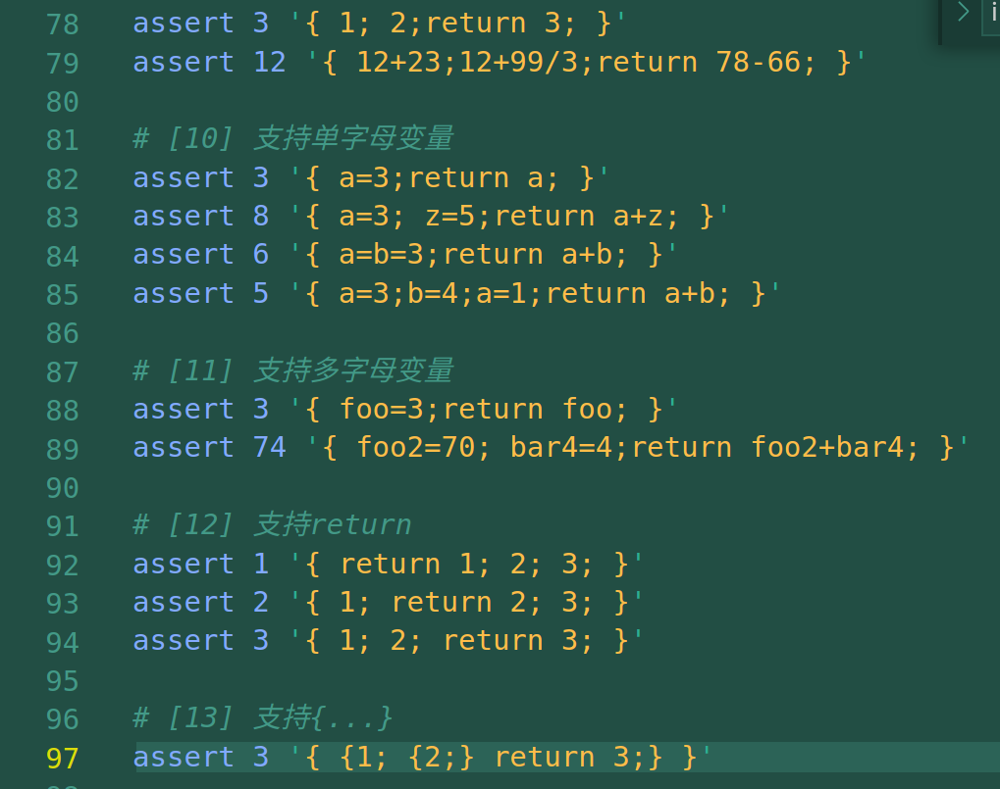
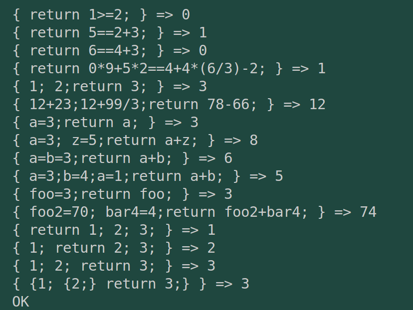
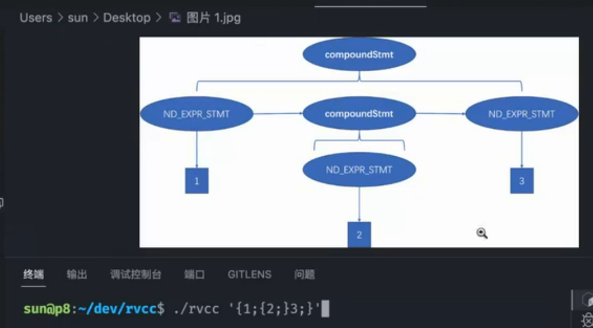
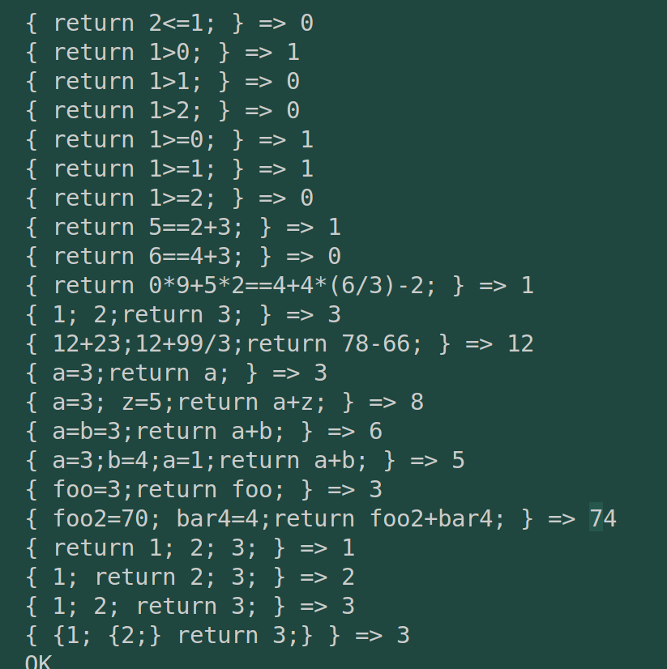

# commit13: 支持{}复合语句

## 1. C程序功能

---

---

可见这次功能就是为程序增加大括号，同时支持大括号的嵌套。

## 2. 阅读C程序

### 2.1 词法

没改动，{ | }是可以识别的。

### 2.2 文法

形成的新AST二叉树为：

---

可以解释为：compound_stmt成为二叉树最高级节点，统领大括号内的所有语句。

> 这里我实现的代码数据结构挺乱的。

### 2.3 代码生成

这部分其实就是适配文法模块新增的数据结构。C语言看起来很轻松，但实际上我的rust写起来就感觉自己的数据结构很复杂。

此处我还遇到了一个bug（起初以为是自己的parser写错了，仔细debug了好几趟，都没有问题），后来比对生成的汇编代码，发现是变量的offset没有设置，在gen_addr的位置一直输出是0。

而变量的offset也是我的代码的“丑陋”的一部分，需要更新两次（重要的是要更新AST中的变量offset）。而step12中新增了一个二叉树子节点种类（Node结构体中的body），所以在修改offset的代码中需要增加对应的分支递归。

## 3. Rust实现

上手觉得挺容易，但是实现起来感觉自己的数据结构很冗余且复杂。AST的树形结构就像是快被我玩坏了。

