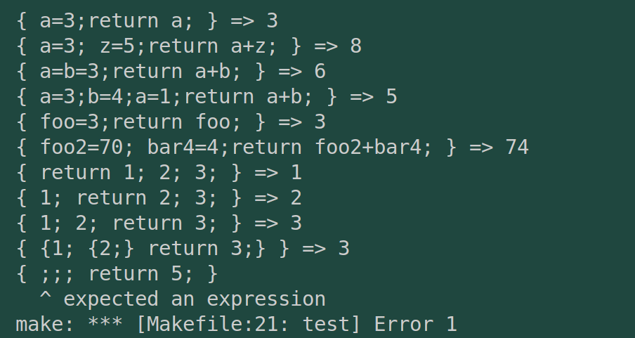
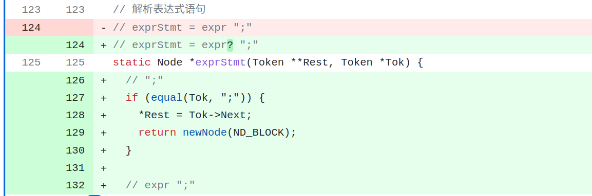
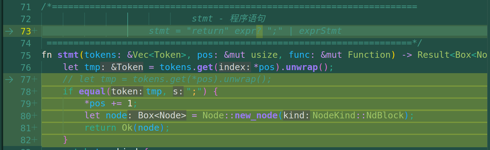
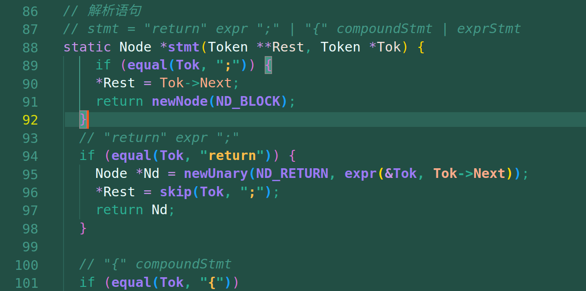
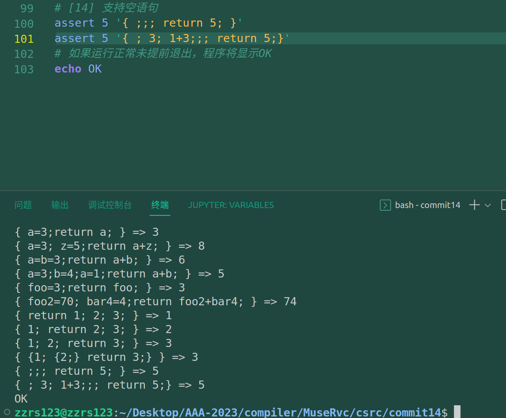

# commit14: 支持空语句

## 1. C程序功能

增加形如 `;;; return 5;`这样 语句 的支持。如果直接拿 commit13来跑，是会出错的，因为我们的文法就要求了分号前必须有expr计算式。

---

而知道了为什么会触发报错，也就知道了如何更改。

## 2. 阅读C程序

C程序只改动了parse.c，而且改动都在上图里。所以不读也罢。

注意这里将空语句视为NdBlock，是因为在代码生成部分对NdBlock有判空return 的规则，所以就可以直接利用这个规则来完成空语句的逻辑实现。

## 3. Rust实现

我的实现倒跟C语言不太一样，我把空语句的解析移到了stmt层次来解析：我觉得是完全可以的。

同时我在C语言中也做了同样操作，依然是可以运行的。

