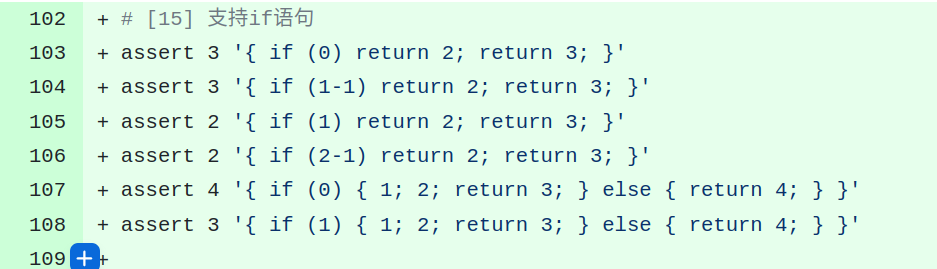
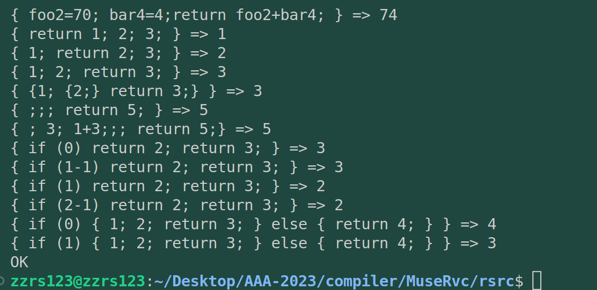

# commit15: 支持 if-else 语句

## 1.  C程序功能

终于来到了比return更重量级的C语句实现。有点开心。实现的if-else类似于下图：

## 2. 阅读C程序

其实这部分结构已经在之前读代码的预想之中了。因为脑子里对if语句的解析方式有准备，所以这部分实现起来很快很快。但还是分几个标题简单说下C程序增加了哪些部分。

### 2.1 头文件 rvcc.h

AST的Nodekind增加了IF类节点：NdIf。同时Node结构体增加 cond(条件)、then(符合条件后的语句)、els(不符合后的语句)。

### 2.2 词法 tokenize.c

建立一个关键词表，将关键词放入数组，泛化 step13 中的 return 的比较，也就是构建好的tokens数组挨个与关键词数组成员比较，如果匹配则修改该token的类型为关键词类型。

### 2.3 文法 parse.c

比较简单，在stmt函数内修改。增加if-then-else的处理逻辑。

### 2.4 代码生成 codegen.c

增加一个count对代码块计数，对跳转代码块进行标号，保证跳转的正确性。

## 3. Rust实现

这部分没有遇到太大的困难。唯一的困难是parser部分在stmt部分增加if语句的节点构建时，对pos的理解不深刻，导致pos多增加了1位，以至于无法正常解析if代码块，删去 `*pos+=1;`就正常了。

