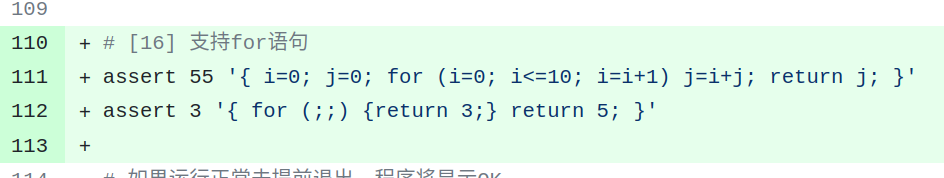
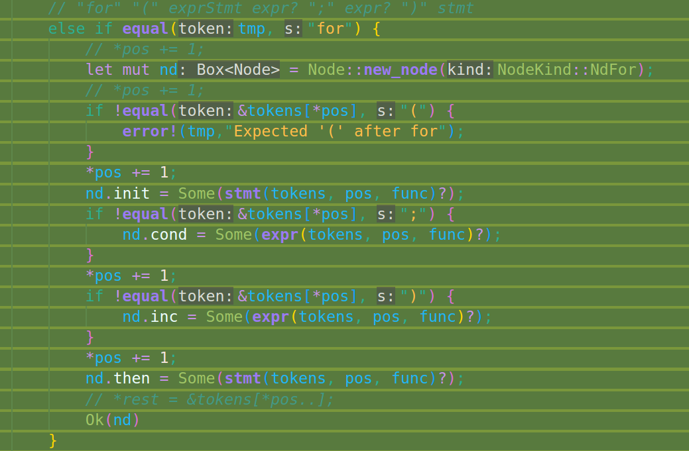
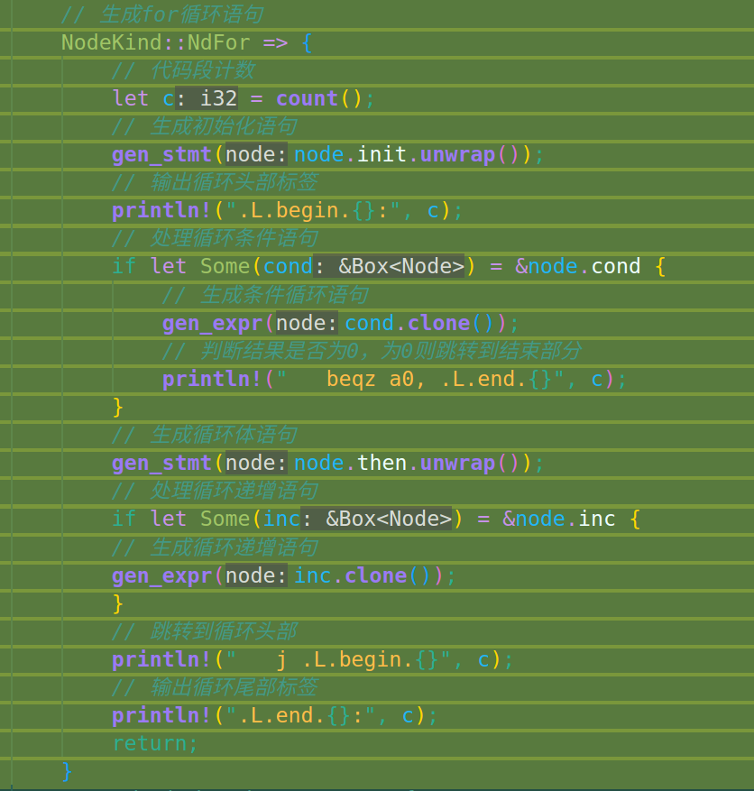

# commit16: 支持 for 语句块

## 1. C程序功能

这部分实现for循环，新增的测试用例如下：（已经很像C程序了）



## 2. 阅读C代码

### 2.1 头文件 rvcc.h

数据结构只增加了几个成员：

```C
...
// *- Nodekind -*
  ND_FOR,       // "for"，循环

...

//*- Node结构体 -*

  // "if"语句 或者 "for"语句
  Node *Cond; // 条件内的表达式
  Node *Then; // 符合条件后的语句
  Node *Els;  // 不符合条件后的语句
  Node *Init; // 初始化语句
  Node *Inc;  // 递增语句
...


```

部分复用了if语句中与for语句中功能相同的语义成员。

### 2.2 词法 tokenize.c

就是关键词表增加一个 for。（后续很多C语言关键词在词法部分都应该就是这种处理）

### 2.3 文法 parse.c

在stmt函数增加相应的文法：

```C
 stmt = "return" expr ";"
        | "if" "(" expr ")" stmt ("else" stmt)?
        | "for" "(" exprStmt expr? ";" expr? ")" stmt
        | "{" compoundStmt
        | exprStmt
```

在for语义分析中进行跟if语句相似的处理（毕竟在Node结构体中还简单复用了部分if语句使用的成员，cond等）

### 2.4 代码生成 codegen.c

依然是在gen_stmt函数中进行与IF相似的操作，因为有跳转，所以一样调用了count来做代码块计数生成独特的标签。

## 3. Rust实现

rust实现没遇到什么很特别的问题（没有修改大框架），注意for(;;)这种空语句（test.sh中已经考虑到了），在parser中需要考虑init成员中出现空语句的情况，调用stmt来处理。

主要的改动如下：

---

(parser中：



---

codegen中：


