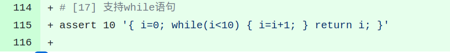
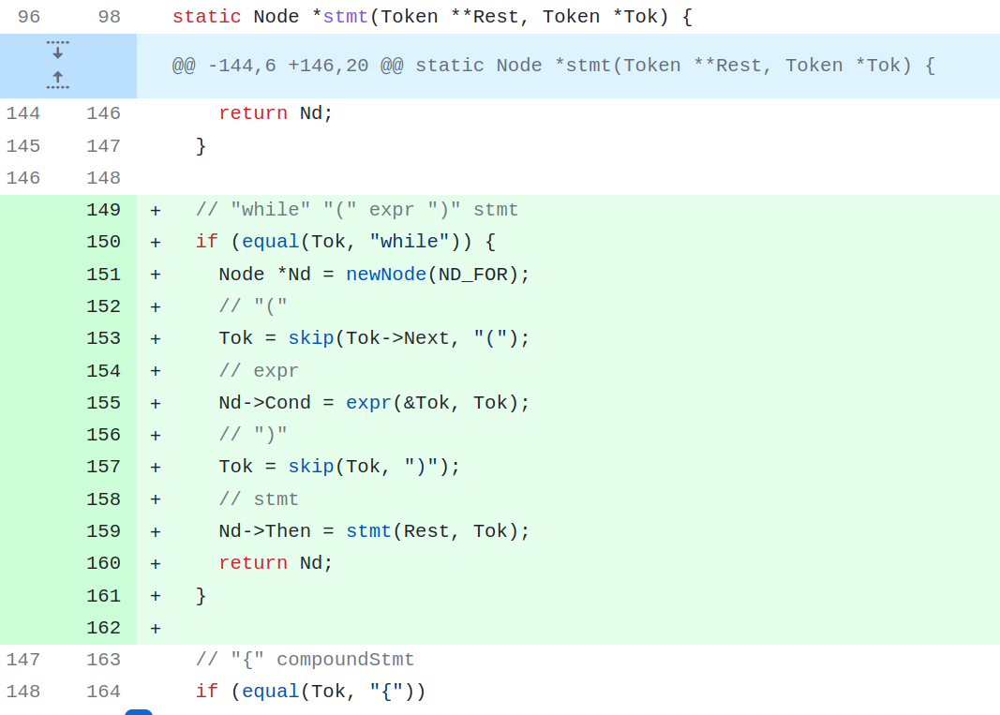
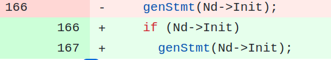
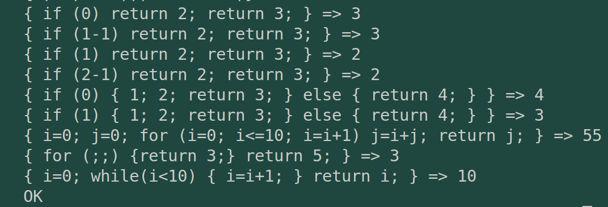

# commit17: 支持while语句

## 1. C程序功能

while语句与for循环很相似（实际上muservc在代码生成时就是同样的生成分支）。测试用例如下：

## 2. 阅读C程序

一起说吧，while语句增添的内容与for语句（step16）极其类似。

* 词法：关键词数组增加 while。
* 文法：相同的解析逻辑。增加代码如下：可见生成的节点跟For语句是一样的NdFor。
  
* 代码生成：就是多一个判断。（这也是语法上，for与while的区别）

  

## 3. Rust实现

没遇到太大困难。

