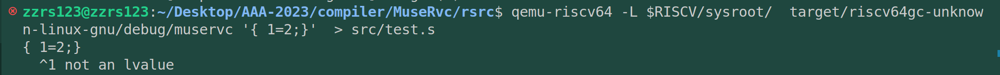

# commit19: 为节点添加相应的终结符，以改进报错信息

这一步主要是完善错误消息系统。这里我感觉原有的报错系统很拉，后面再进行魔改。

先是需要在Node中增加一个Tok节点，这里我认为直接存loc就可以。因为我的error!宏只需要一个错误位置，后续loc可以改成Position结构体，Position单独分出来一个.rs来计算错误在C代码中发生的位置。

但目前来说，需要在Parser.rs中每一级函数中添加一个loc参数来传递，让AST树的每个Node上都有一个loc参数。（参考青木峰郎-自制编译器的cbc编译器来看，这个loc后续改成Position后可以放到parser结构体中，而全部语法解析函数可以作为impl，这样自己的结构就算功德圆满了 ）

---

**现在自己的muservc有一个很严重的问题：前后端耦合，我无法产生中间代码。**

这样就不能体验 后端分配计算资源 的快乐了。

对于这点我决定先不着急，先不要磨灭自己做事情的意义感，先把功能都添加完善（也就是lexer和parser都通过目前的codegen测试正确，再去考虑IR处理AST产生代码，与codegen再连接）。一边调研 AST to IR 的方法，一遍继续进行自己的step。

---

step18本身还是比较简单的，按照我的构想，只需要在new_node等函数中增加tok传入参数，将Node结构体的tokloc成员填充为tok.loc，后面在codegen进行取出使用error!即可。

这里不可避免又要跟 error.rs 中 的 error宏打交道，很明显自己的error宏还是有问题，我现在虽然能直接匹配 tok（token结构体类型）+ 一个报错信息来产生报错提示，但在匹配 loc（tokloc）+ 报错信息 时，必须让报错信息是一个包含 "{}" 的格式化字符串，而不能是一个简单的字符串报错信息。 

下面是我的报错系统的现状。主要是捕捉 codegen部分的 错误余孽（这里主要是符合语法但是不符合代码逻辑的问题）。

