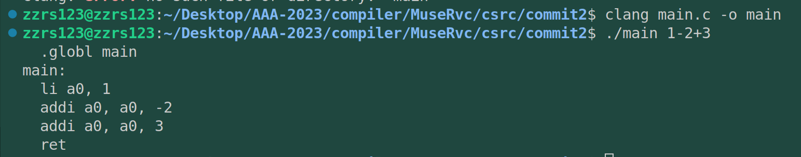
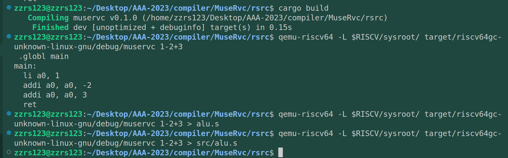

# commit2：支持+-运算

## 1. C程序功能



> 为了方便起见没有用riscv工具链。

riscv没有sub指令，但addi的操作数可以是负数。这段代码还是比较简单的，扫描输入参数字符串，把他放入.s文件（`./main 1-2+3>tmp.s`）即可得到对应汇编。

> 此外，addi指令的立即数上限不是很大，要加载大数字，还有其他指令。


## 2. rust

而用rust实现上述功能就有更多可能了（毕竟rust要比C高级很多）。但是写起来磕磕绊绊的。下面是我的最后实现：

```rust
use std::env;
use std::process::*;
// use std::str::FromStr;
fn main() {
    // 从命令行参数中获取传入的参数
    let args: Vec<String> = env::args().collect();

        // 判断传入程序的参数是否为2个，args[0]为程序名称，args[1]为传入的第一个参数
        if args.len() != 2 {
            // 异常处理，提示参数数量不对。
            // eprintln，向标准错误流输出字符串
            eprintln!("{}: invalid number of arguments", args[0]);
            // 程序返回值不为0时，表示存在错误
            exit(1);
    }

    let opera = args[1].as_str();

    let mut iter = opera.chars();//创建了一个字符迭代器
    let mut p = iter.next();//获取其第一个字符

    println!(" .globl main");
    println!("main:");
    let c = p.unwrap();

    println!("  li a0, {}",c);
  
    while let Some(op) = iter.next() {
    
        match op {
            '+' => {
                p=iter.next();//跳过+号
                println!("  addi a0, a0, {}", p.unwrap());
                continue;
            }   
            '-' => {
                p=iter.next();//跳过-号
                println!("  addi a0, a0, -{}", p.unwrap());
                // println!("  add a0, a0, t0");
                continue;
            }
            _ => panic!("unexpected operator"),
        }
    }
    println!("  ret");
}

```

rust的代码的关键一点是None值的处理，用Some可以很好解决。下面是执行截图：


