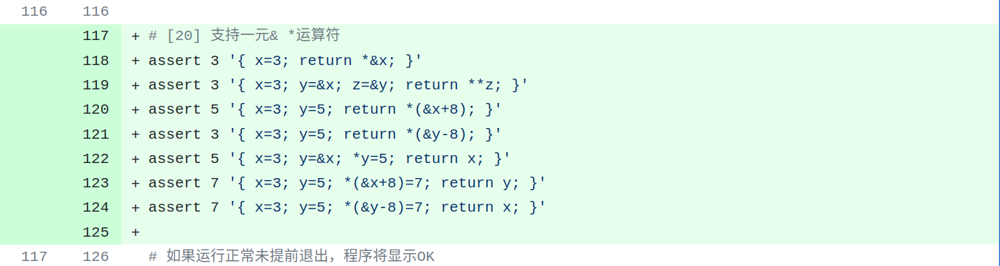
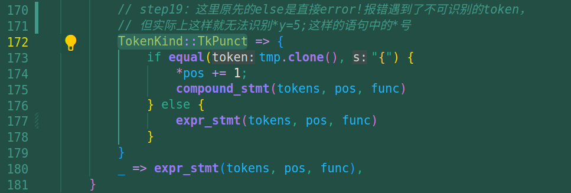
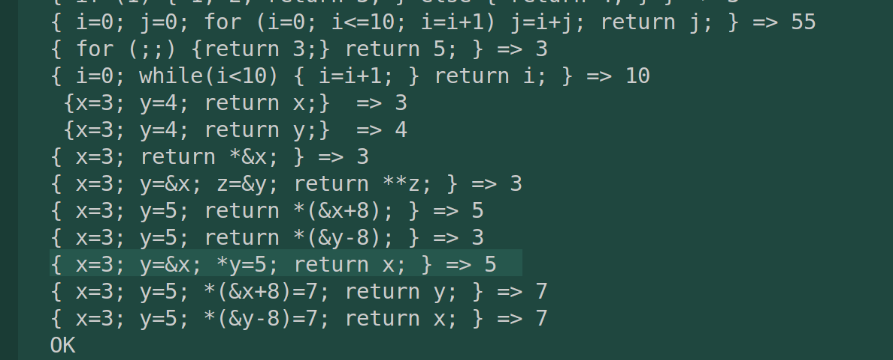

# commit20: 支持一元&*运算符

## 1. 程序功能

很明显，step19要实现的是**C语言特色运算：*和&**。

test.sh测试用例如下：注意这里的指针运算与规范C语言有区别，C语言不会出现 `*(&x+8)` 这种运算，而应该是 `*(x+1)`。不过这里确实+8偏移8个字节才能从x访问到y内的内容。step20里会实现指针运算。



## 2. rust实现

没必要再专门写C语言阅读了，架构没变。

### 2.1 增加内容

* ast.rs 中增加Node结构体成员NdAddr、NdDeref，作为&和*的节点类型。
* parser.rs 中在unary层次中增加*和&的解析。与此前该层次的一元运算符的+ - 代码块结构完全相同。
* codegen.rs
  * gen_addr 中，增加以下代码，目的就是产生 `*&y;`对应的汇编代码。

    ```rust
            // 解引用*
            NodeKind::NdDeref => {
                gen_expr(node.lhs.unwrap());
                return;
            }
    ```
  * gen_expr 中，增加以下代码：用于解决取址和解引用的问题。

    ```rust
            NodeKind::NdDeref  => {
                gen_expr(node.clone().lhs.unwrap());
                println!("   # 读取a0中存放的地址,得到的值存入a0");
                println!("   ld a0, 0(a0)");
                return;
            }
            NodeKind::NdAddr   => {
                gen_addr(node.clone().lhs.unwrap());
                return;
            }
    ```

### 2.2 解决了一个比较致命的bug

致命的bug在代码注释中也有标出：即codegen.rs中的  `assign_lvar_offsets` 设置变量栈这个函数，设置的变量offset是反的，就比如有a b 两个变量，a先压栈、b后压栈，压入的位置是不对的。

这个点在测试用例 { x=3; y=5; return *(&x+8); } => 5 处被K的淋漓尽致。

修改方法就是简单的反转列表，再根据先后顺序取计算offset，就正常了。

### 2.3 parser.rs中的一个语义逻辑问题

解决了2.2还是有问题，无法通过 { x=3; y=&x; *y=5; return x; } => 5测试用例。

debug发现，在解析到 `*y=5;`这个stmt时（stmts在我的设计中是一个循环，这是第三个），在stmt中会匹配到TokenKind::TkPunct分支，由于*号不是"{"，就会走到else中的error!报错系统，进而导致系统崩溃。

所以很明显，这个else应当继续走expr_stmt，而不应该直接报错。修改如下：



修改之后一切正常，测试用例通过。

## 3. 看看效果


