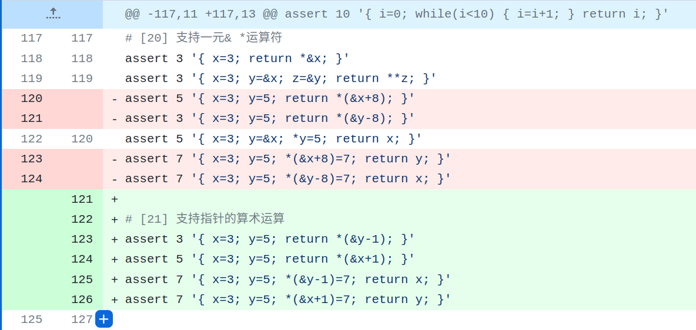
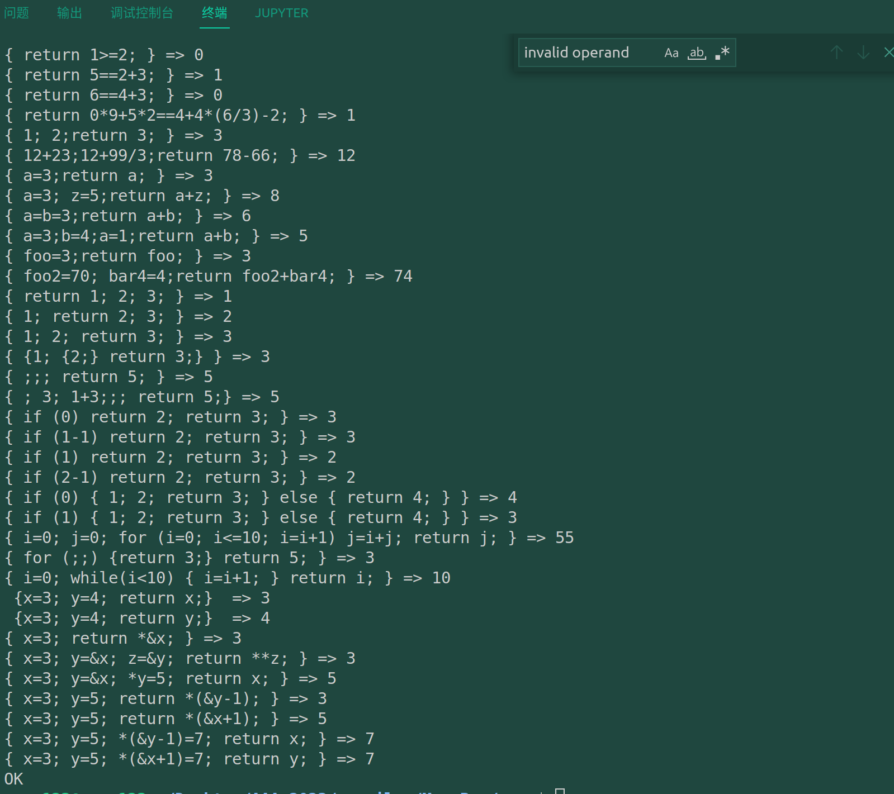

# commit21: 支持指针算术运算

## 1. 程序功能

很明显，step19中实现的类指针计算有大问题且是一种权宜之计，究其根本就是编译器还没有支持类型，编译器无法根据变量的类型来决定它指针加法运算数的类型。step20就来完成这件事。下面是本次测试用例：

## 2. Rust实现

实现正确的指针运算，就是引入一个变量的类型系统的过程。

> **这里我开摆了很久，因为加入类型系统经证实不是一件容易的事情。我在这里甚至开始怀疑自己写的代码，很丑陋。要不要直接找一个相对成熟的代码进行后端的修改。最后我还是摆脱了颓废和自我怀疑，完成了这部分类型系统。**

这里有几个有趣的点。简单写一下。

* base_ty写的很神奇，指针类型它并不能全部判断出来，后面直接新写了一个Is_pointer来判断
  （这一点影响了某两个测试用例无法通过。）
* type系统与AST Node系统的接洽也很迷惑，为了验证Parser的正确性，我还编写了 parser-test函数（print-node），确认了AST树节点丢失的问题（也就是语句传入AddType后直接没有返回），其实这在C语言不能想象，因为传入指针，不必返回就能得到指针所指处修改后的结果。
  而rust中就不行，我增加了显式的赋值。
* 类型系统中涉及了大量的所有权和生命周期问题,,,,,,
* 想到再增加吧，总之这次的代码增加量应当不小吧。后面也要加油继续做。

