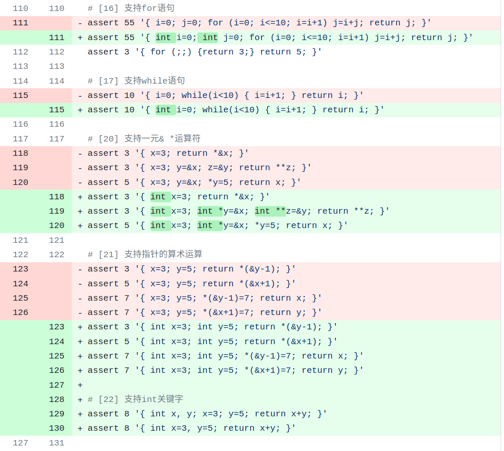
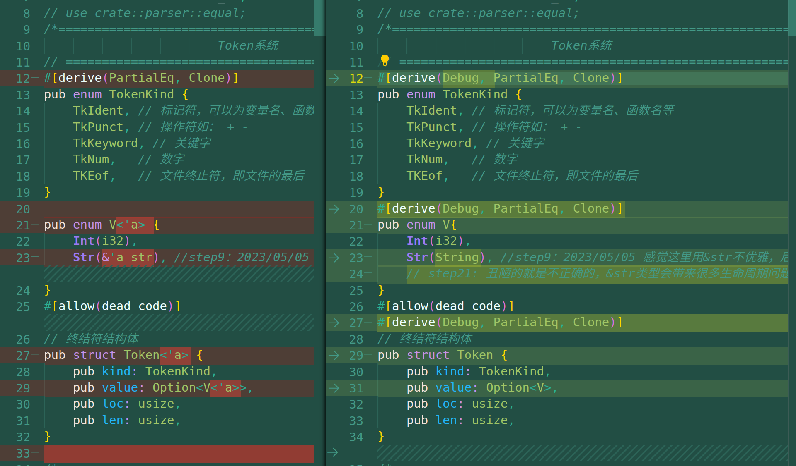
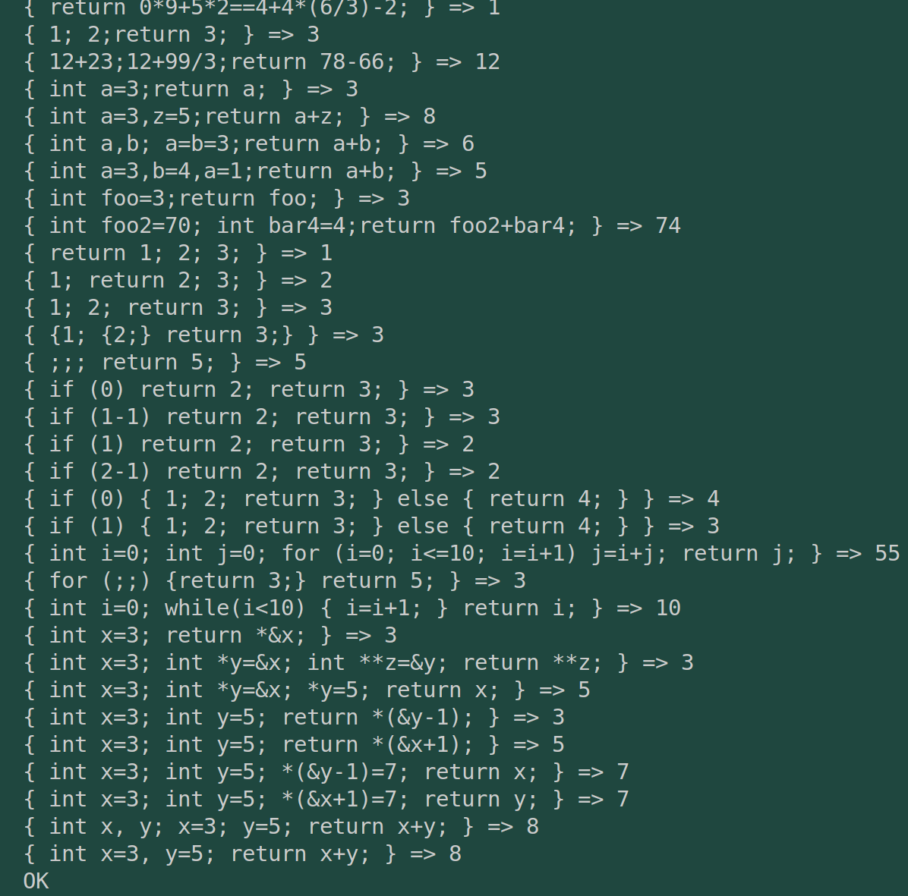
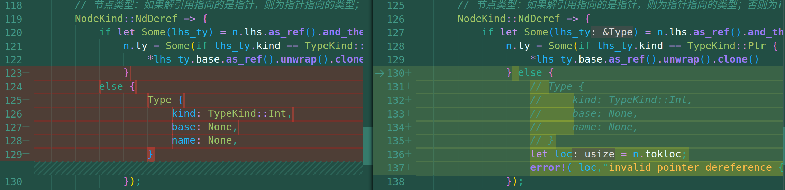
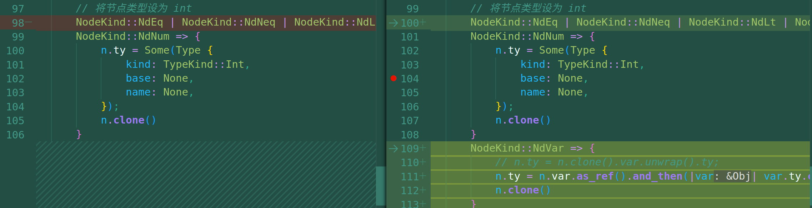
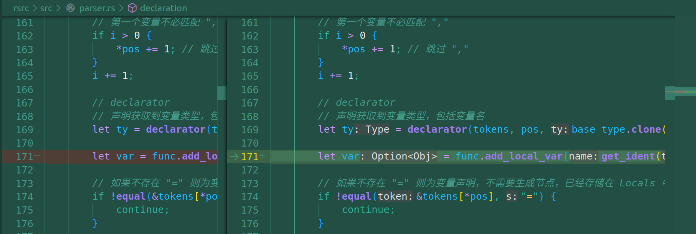
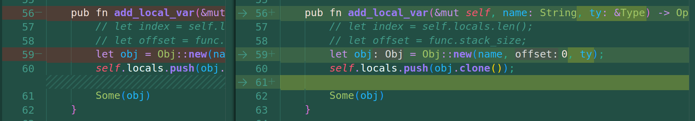
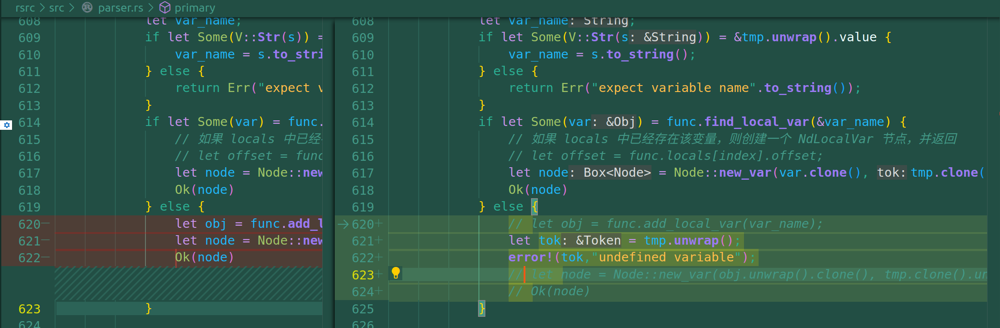

# commit22: 支持 int 关键字定义变量

## 1. 程序功能

此前我们总是默认 我们使用的变量 和 数字 都是Int类型。对它增加显式的声明。测试用例更改如下：

## 2. Rust实现

这里又困扰了我很久很久，但实际上并没有我想的那么难。主要是rust语法本身的问题。

### 2.1 关于int关键字的实现思路

主要是文法，引入一个变量声明与赋值的解析层次，在combound_stmt 轮询 stmt的循环中，增加  declaration ，也就是说 declaration 和 stmt 是平行的。

接着在声明处理中，依次解析变量的类型（给Obj结构体的ty成员赋type），解析声明多变量的情况，最后调用赋值解析Assign函数。

### 2.2 rust生命周期引发的bug

之前自己的Token系统的数据结构，与现在的比较如下：

正是&str引发了一系列的生命周期问题，如果继续沿用&str切片，会引发一系列rust函数和变量的周期问题，所以果断改了。

下面是运行结果。

## 3. 05/26: 一处逻辑问题的排除

昨天05/25，虽然通过了test.sh，但是逻辑问题很明显，具体问题与修改如下：

* 主要问题是类型判别系统中，原来有一些偷懒的行为：
  * 下图图一，Deref 类型时，如果不是指针类型，原先默认为Int，但应该使其报错。
  * 下图图二，Var类型也不能直接与Num类型做同样的处理，而应该与Node的Var成员的ty保持一致。

而很明显，还需要把作出其他调整，因为var的ty默认都是None，直接make test会导引到 new_add 和 new_sub 的 None,None 分支，直接导致程序崩溃。一方面在declaration解析函数中，解析到变量进行add_local_var的时候，需要顺便将ty（Type）参数传入，生成一个包含该 ty 的 Obj 类型的变量 var。另一方面是原有的primary函数中add_local_var逻辑就不再需要了，因为变量声明中变量一定都出现过了，后续不用Int声明的变量其实是不合法的。

