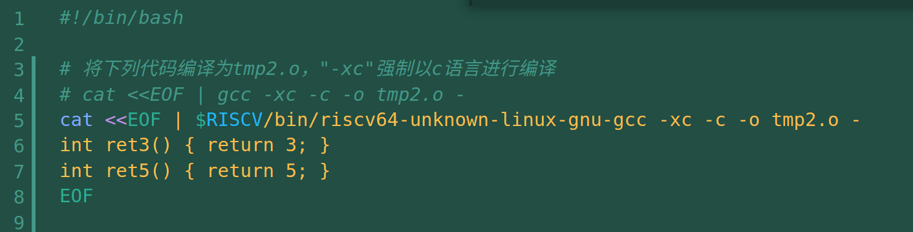
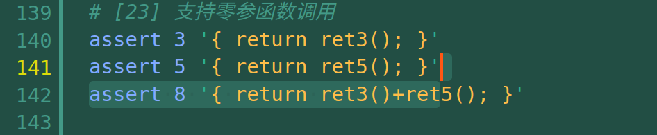
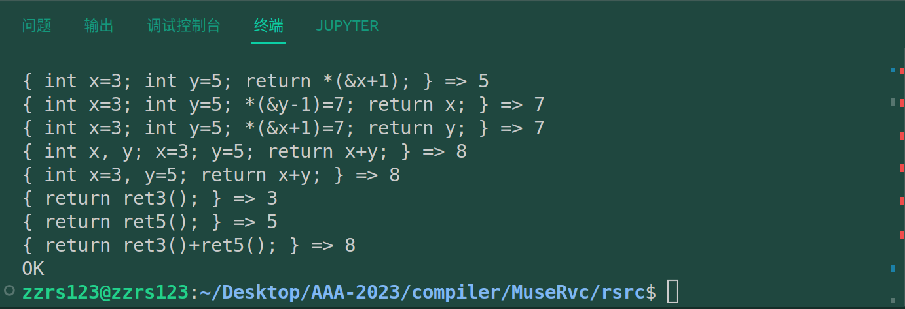

# commit23: 支持函数调用

## 1. 思路与测试

函数调用是一个很大的模块。估计又要磨很久。我想可以先实现一个函数调用，再实现函数定义。

先支持在自己的C程中调用一个函数，这个函数可以是编译时链接进来的（也就是函数此时在外部文件中）。这一点是在test.sh脚本中实现的：

测试用例如下：

## 2. rust实现

其实这样就已经很简化了。词法不需要改动，文法只需要在primary解析中增加函数与变量的区别即可。代码生成则需要考虑ra寄存器的压栈和弹栈，在分析到FunctionCall节点时，生成对应标签代码的调用语句。类型系统偷了个懒，目前是只要是FunctionCall节点，就给他Int类型。

整个过程没有遇到太多问题：

