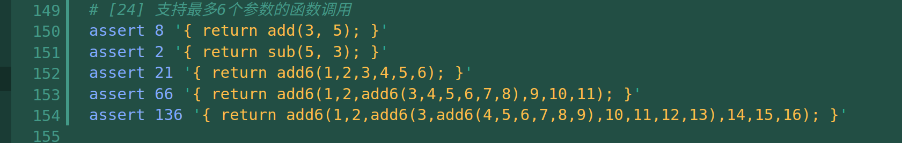
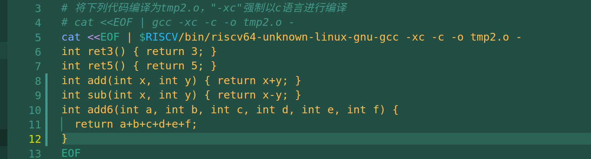
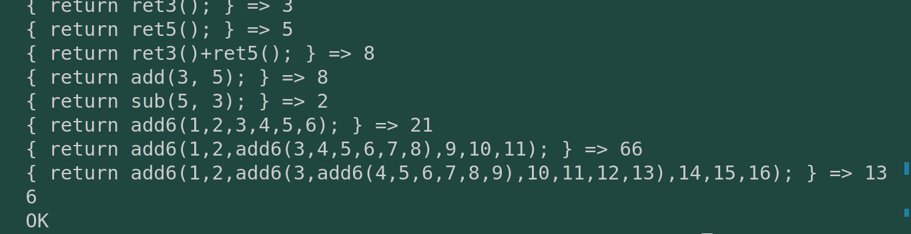

# commit24: 支持最多6个参数的函数调用

简单讲讲需求和实现方法。

## 1. 功能描述

首先是测试用例的增加：

当然链接文件也有增加：

## 2. 实现

词法不更改

文法在primary中的变量分支（因为变量和函数名都是Ident类型），根据后面跟不跟小括号来确定是否是函数；接着进入funccall的解析函数，增加args成员来记录参数节点的链表控制。这里我对于*pos的+1与否还产生了不小的纠结。

调通后不禁感叹自己的这个设计不好（设计指将*pos裸露在parser.rs中），没有设计一个那种跳过某个字符的函数。

代码生成则是，丰富Funcall节点的代码生成代码。遍历args链表，压栈，然后弹栈到寄存器中。因为还没有实现函数的定义，所以寄存器到这里就可以了，所以生成的逻辑还算简单。

还有一件值得记录的事情，那就是调通这部分代码的下午，正好听到 《留白》 这首歌进入副歌高潮部分：“我有些许深情的独白”，伸懒腰，突然很爽。
