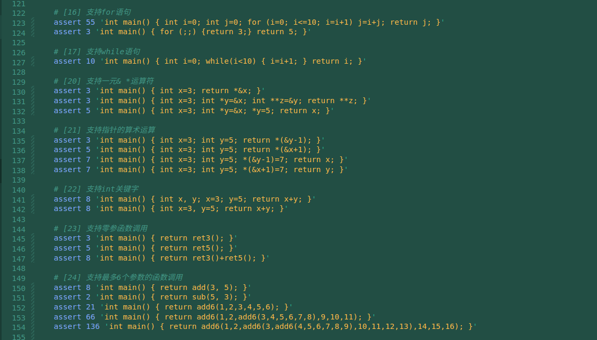
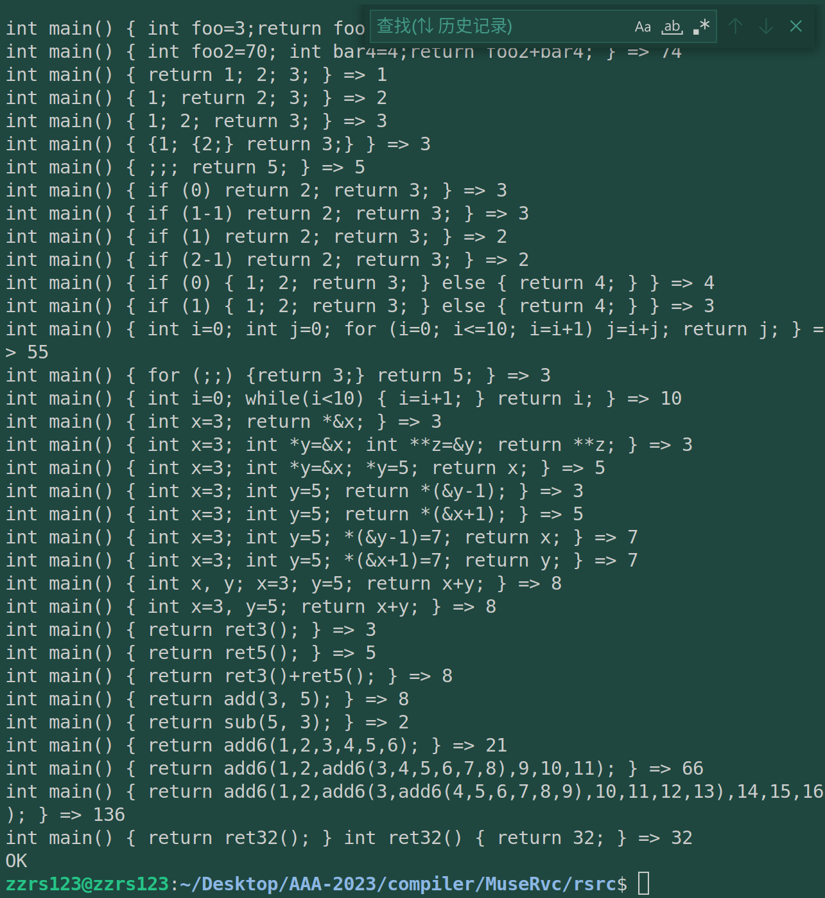

# commit25: 支持零参函数定义

这个是比较激动人心的时刻了，这个step的实现意味着C语言的雏形乍现。

## 1. 功能

看看测试用例，已经很像为人所熟悉的C语言了：

## 2. 实现

词法不变。

文法：需要增加 int 函数名()的解析，后面 compound_stmt 之后不变。注意，因为要实现函数定义，所以处理的字符流中就不止一个函数了，我增加了一个Program结构体，其中放入一个函数列表成员，用Vec实现函数的存储。

代码生成：其实改动不大，就是在codegen上位主控函数中启动一个for循环，对每个函数产生对应的汇编，主要是对标签名字的特异化处理。

