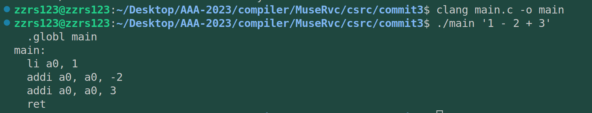

# commit3：加入终结符解析器解析空格

## 1. C程序功能



可以看到上面的参数字符串中有空格。所以这部分改动就是增加对空格的解析。

## 2. C程序阅读

### 2.1 Error

引入了一个Error函数来封装错误处理，并且这个函数是一个变参函数。

```C
// 输出错误信息
// static文件内可以访问的函数
// Fmt为传入的字符串， ... 为可变参数，表示Fmt后面所有的参数
static void error(char *Fmt, ...) {
  // 定义一个va_list变量
  va_list VA;
  // VA获取Fmt后面的所有参数
  va_start(VA, Fmt);
  // vfprintf可以输出va_list类型的参数
  vfprintf(stderr, Fmt, VA);
  // 在结尾加上一个换行符，如果是stdout，就相当于println了
  fprintf(stderr, "\n");
  // 清除VA
  va_end(VA);
  // 终止程序
  exit(1);
}
```

### 2.2 tokenize

```C
  // 解析Argv[1]
  Token *Tok = tokenize(Argv[1]);
```

引入了tokenize来处理终结符的生成。这次的处理是想要生成类似于 `(head) -> 1 -> - -> 2 -> + -> 3`的链表。所以该C函数中就是链表操作。通过链表的处理，完成对输入字符串的每个元素的处理（相当于commit2的+-，但是拓展了更多，更加普适）。

```C
// 终结符解析
static Token *tokenize(char *P) {
  Token Head = {};
  Token *Cur = &Head;

  while (*P) {
    // 跳过所有空白符如：空格、回车
    if (isspace(*P)) {
      ++P;
      continue;
    }

    // 解析数字
    if (isdigit(*P)) {
      // 初始化，类似于C++的构造函数
      // 我们不使用Head来存储信息，仅用来表示链表入口，这样每次都是存储在Cur->Next
      // 否则下述操作将使第一个Token的地址不在Head中。
      Cur->Next = newToken(TK_NUM, P, P);
      // 指针前进
      Cur = Cur->Next;
      const char *OldPtr = P;
      Cur->Val = strtoul(P, &P, 10);
      Cur->Len = P - OldPtr;
      continue;
    }

    // 解析操作符
    if (*P == '+' || *P == '-') {
      // 操作符长度都为1
      Cur->Next = newToken(TK_PUNCT, P, P + 1);
      Cur = Cur->Next;
      ++P;
      continue;
    }

    // 处理无法识别的字符
    error("invalid token: %c", *P);
  }

  // 解析结束，增加一个EOF，表示终止符。
  Cur->Next = newToken(TK_EOF, P, P);
  // Head无内容，所以直接返回Next
  return Head.Next;
}
```

不过在Rust中链表的麻烦会被解决。

Token结构体 以及终结符的 类型：

```C

// 为每个终结符都设置种类来表示
typedef enum {
  TK_PUNCT, // 操作符如： + -
  TK_NUM,   // 数字
  TK_EOF,   // 文件终止符，即文件的最后
} TokenKind;

// 终结符结构体
typedef struct Token Token;
struct Token {
  TokenKind Kind; // 种类
  Token *Next;    // 指向下一终结符
  int Val;        // 值
  char *Loc;      // 在解析的字符串内的位置
  int Len;        // 长度
};
```

### 2.3 总结

这里讲解的我感觉有点乱，其实在commit2的基础上，commit3的main函数很好理解，依然是相似的功能，只不过引入了Token处理系统，将**字符串遍历解析**跟**字符串输出**分开了。所以我感觉用rust只会更好写。

## 3. rust实现

在写之前，我先把commit2中的rust推送一下。推送commit为 `<suppport '+'&&'-' in rust>`

> 第一次知道commit也可以用来版本管理，之前知道这个特性，但不知道这么方便。

### 3.1 error宏

宏的相关知识总结：

* 当 Rust 的宏被调用时，宏将尝试匹配参数模式，以确定宏如何生成代码。
* 使用 `macro_rules` 宏来定义一个宏，使用 `$fmt:expr $(, $arg:expr)*` 的参数模式。
* 这个模式表示第一个参数 `$fmt` 是一个表达式，后面可以有任意数量的额外参数，每个参数都是一个表达式。
* 在宏定义的主体中，我们使用 Rust 的字符串连接宏 `concat!()` 将格式字符串 `$fmt` 和其他参数（如果有）组合成一个字符串，然后使用 `eprint!()` 将它们打印到 stderr 流中。
* 在这个宏中，使用 `$()` 捕获任意数量的额外参数，并将它们序列化为逗号分隔的参数列表。这样可以使得额外参数在 `eprint!()` 函数中被正确地插入到格式字符串中。
* 使用 `std::process::exit` 函数终止程序，确保在打印错误消息后程序能够立即退出。

### 3.2 Token系统：tokenize

需要完全理解C的Token与Rust的特性。C中实现的是一个链表，而我打算使用Rust中的 `Vec`<T>`````类型来实现。


当指针 `p` 所指向的字符是数字时，会进行解析数字的操作。这里使用 Rust 语言标准库中的 `char::is_ascii_digit()` 方法来判断字符是否是数字。接下来，我们创建一个新的 Token，并将其 `kind` 字段设置为 `TokenKind::Num` 表示数字类型，并将该 Token 的 `next` 字段设置为 None。

然后，我们使用 `p.by_ref().take_while(|c| c.is_ascii_digit())` 迭代器获取数字文本部分，并使用 `parse()` 方法将其转换为 i32 类型。该方法会返回 Result 枚举类型，解析成功时会返回 Ok(val)，其中 val 为解析出的数字，否则返回 Err(err)。在这里，我们需要使用 `unwrap_or_else()` 函数接收解析结果。其中闭包函数为打印错误信息并退出。

然后，我们将解析出的数字存储在 Token 的 `val` 字段中，并根据 `val` 计算出数字长度并将其存储在 `len` 字段中。

最后一个 `continue;` 语句用于跳过已处理的数字部分，并继续下一次循环处理下一个 Token。

使用 `is_whitespace()` 方法来检查字符是否为空白字符。如果当前字符为空白字符，我们将 `start` 更新为下一个字符的位置即 `i + 1`。

如果字符不是一个操作符，也不是一个数字，而且也不是空白字符，则我们假定它是一个错误的字符，并调用 `error!()` 宏来记录错误信息。注意，在这里我们使用了一个 `_` 作为默认分支，它无需指定任何逻辑，因为我们已经考虑了所有情况，所以它起到一个简单的占位符的作用。

最终，我们的代码将会跳过所有空白字符，并解析所有有效的操作符和数字，如果遇到错误的字符，会记录错误信息。

### 3.3 一些语法的不熟悉以及第一版代码

毕竟rust相较于C来说还算是仓促上手，写起来很难受很难受，debug了一天，把equal函数的str类型暂时换为char才勉强编译执行成功。下面是我将-{}改为+{}的输出结果，很显然，这是我的equal函数的问题，所以我重写了一遍，甚至不惜增加了一个字段专门存储'+'和'-'（暂定为Option `<char>`型），再重写equal才成功。下图是逻辑错误的执行情况：


编译成功，0421（明天）尝试统一一下Token的字段值。


代码如下：

```rust
use std::env;
use std::process::*;
// use std::str::FromStr;

/*=====================================================================
    Token系统
// ====================================================================== */
#[derive(PartialEq)]
enum TokenKind {
    TkPunct, // 操作符如： + -
    TkNum,   // 数字
    TKEof,   // 文件终止符，即文件的最后
}

struct Token<'a> {
    kind: TokenKind,
    val: Option<i32>,
    loc: &'a str,
    len: usize,//rust版本删除了用于构建链表的next
    sss: Option<char>,
}

/*=====================================================================
    error 宏
    在这个宏中，用 $fmt 作为必需的参数。
    然后使用 $arg 变量来捕获任意数量的额外参数。
    使用 eprint! 和 \n 字符将消息输出到 stderr 流中
 ======================================================================*/ 
macro_rules! error {
    ($fmt:expr $(, $arg:expr)*) => {{
        eprint!(concat!($fmt, "\n") $(, $arg)*);
        exit(1);
    }};
}


// 返回 TKNUM 的值
fn get_token_number(token: Option<&Token>) -> i32 {
   
    if let Some(t) = token {
        if let Some(v) = t.val {
            return v as i32;
        }
    }
    error!("expect a number");
}

fn equal(token: &Token, str: char) -> bool {
    // 比较字符串LHS（左部），RHS（右部）的前N位，S2的长度应大于等于N.
    // 比较按照字典序，LHS<RHS回负值，LHS=RHS返回0，LHS>RHS返回正值
    // 同时确保，此处的Op位数=N
    let ch: Option<char> = token.sss;
    if ch == Some(str){
        true
    }else {
        false
    }

}

/*======================================================================
                    toknize: Token解析主干函数
            从头到尾扫描args[1]，对不同类型的token做不同处理
                rust用match+vec<T>实现起来是相当优雅的
====================================================================== */
// 终结符解析
fn tokenize(arg: &mut str) -> Vec<Token> {
    let mut tokens = Vec::new();
    let mut start = 0;
    // arg.char_indices()同时得到索引和字符，对得到的字符用match进行处理
    for (i, c) in arg.char_indices() {
        match c {
            // 处理空白字符
            c if c.is_whitespace() => {
                start = i + 1;
            },
            // 解析操作符
            // 特点是长度一定为1
            '+' | '-' => {
                let token = Token {
                    kind: TokenKind::TkPunct,
                    val: None,
                    loc: &arg[start..i],
                    len: 1, // 操作符长度为1
                    sss: Some(c), // 将操作符解析到 sss 字段
                };
                tokens.push(token);
                start = i + 1;
            },
            // 解析数字
            '0'..='9' =>  {
                let mut end = i;
                while let Some(c) = arg.chars().nth(end) {
                    if c.is_digit(10) {
                        end += 1;
                    } else {
                        break;
                    }
                }
                let numeric = arg[start..end].parse::<i32>().ok();
                let token = Token {
                    kind: TokenKind::TkNum,
                    val: numeric,
                    loc: &arg[start..end],
                    len: end - start,
                    sss:None
                };
                tokens.push(token);
                start = end;
            }
            _ => {
                error!("Unexpected character '{}'", c);
            }
        }
    }
    let eof_token = Token {
        kind: TokenKind::TKEof,
        val: None,
        loc: &arg[start..],
        len: arg.len() - start,
        sss:None,
    };
    tokens.push(eof_token);
    tokens
}


fn main() {
    // 从命令行参数中获取传入的参数
    let mut args: Vec<String> = env::args().collect();

        // 判断传入程序的参数是否为2个，args[0]为程序名称，args[1]为传入的第一个参数
        if args.len() != 2 {
            // 异常处理，提示参数数量不对。
            // 封装为error宏
            error!("{}: invalid number of arguments", &args[0]);
    }
  
    // 接下来引入Token解析系统
    // let opera = args[1].as_str();
    let tok = tokenize(args[1].as_mut_str());

    // let mut iter = tok.chars();//创建了一个字符迭代器
    // let mut p = iter.next();//获取其第一个字符
    let mut iter = tok.iter();// 创建了一个迭代器

    let mut p = iter.next();//获取其第一个token
    // 声明全局main段，也是程序入口段
    println!("  .globl main");
  
    // main段标签
    println!("main:");

    // li为addi别名指令，加载一个立即数到寄存器中
    // 这里我们将算式分解为 num (op num) (op num)... 的形式
    // 所以先将第一个 num 传入a0
    let c = p.unwrap();
    let num = get_token_number(Some(c));
    println!("  li a0, {}", num);
  
  
  
    while let Some(op) = iter.next() {
        // println!("{}",op.loc);
        match op.kind{
            TokenKind::TKEof    => {
                break // 这里不能error！，直接退出不能打印ret
            }
            TokenKind::TkPunct  => {
                if equal(op, '+'){
                    p = iter.next(); // 跳过 + 号
                    println!("  addi a0, a0, {}", get_token_number(Some(p.unwrap())));
                    // println!("dsfsd");
                } else {
                    p = iter.next(); // 跳过 - 号
                    println!("  addi a0, a0, -{}", get_token_number(Some(p.unwrap())));
                    // println!("dsfsd111");
                }
                // println!("{}",get_token_number(Some(p.unwrap())));
          
            }
      
            TokenKind::TkNum    => {
                error!("unexpected num!")
            }
        }
    }


    println!("  ret");
}

```


### 3.4 第二版代码：sss字段从char扩展到&a' str

接下来我又整顿精神（实际上已经是第二天早上0421了），把sss字段的char类型改回&str类型，为以后支持"!="、"&&"这种操作符做准备。同时还需要加上生命周期的声明a'。代码如下：

```rust
use std::env;
use std::process::*;
// use std::str::FromStr;

/*=====================================================================
    Token系统
// ====================================================================== */
#[derive(PartialEq)]
enum TokenKind {
    TkPunct, // 操作符如： + -
    TkNum,   // 数字
    TKEof,   // 文件终止符，即文件的最后
}

struct Token<'a> {
    kind: TokenKind,
    val: Option<i32>,
    // loc: &'a str,
    len: usize,//rust版本删除了用于构建链表的next
    sss: Option<&'a str>,
}

/*=====================================================================
    error 宏
    在这个宏中，用 $fmt 作为必需的参数。
    然后使用 $arg 变量来捕获任意数量的额外参数。
    使用 eprint! 和 \n 字符将消息输出到 stderr 流中
 ======================================================================*/ 
macro_rules! error {
    ($fmt:expr $(, $arg:expr)*) => {{
        eprint!(concat!($fmt, "\n") $(, $arg)*);
        exit(1);
    }};
}


// 返回 TKNUM 的值
fn get_token_number(token: Option<&Token>) -> i32 {
   
    if let Some(t) = token {
        if let Some(v) = t.val {
            return v as i32;
        }
    }
    error!("expect a number");
}

fn equal(token: &Token, str: &str) -> bool {
    // 比较字符串LHS（左部），RHS（右部）的前N位，S2的长度应大于等于N.
    // 比较按照字典序，LHS<RHS回负值，LHS=RHS返回0，LHS>RHS返回正值
    // 同时确保，此处的Op位数=N
    let ch= token.sss;
    if token.len != str.len(){
        false
    }else if ch == Some(str){
        true
    }else {
        false
    }
}

/*======================================================================
                    toknize: Token解析主干函数
            从头到尾扫描args[1]，对不同类型的token做不同处理
                rust用match+vec<T>实现起来是相当优雅的
====================================================================== */
// 终结符解析
fn tokenize(arg: &mut str) -> Vec<Token> {
    let mut tokens = Vec::new();
    let mut start = 0;
    // arg.char_indices()同时得到索引和字符，对得到的字符用match进行处理
    for (i, c) in arg.char_indices() {
        match c {
            // 处理空白字符
            c if c.is_whitespace() => {
                start = i + 1;
            },
            // 解析操作符
            // 特点是长度一定为1
            '+' | '-' => {
                let str1=&arg[start..=i] ;
                let token = Token {
                    kind: TokenKind::TkPunct,
                    val: None,
                    // loc: &arg[start..i],
                    len: 1, // 操作符长度为1
                    sss: Some(str1), // 将操作符解析到 sss 字段
                };
                tokens.push(token);
                start = i + 1;
            },
            // 解析数字
            '0'..='9' =>  {
                let mut end = i;
                while let Some(c) = arg.chars().nth(end) {
                    if c.is_digit(10) {
                        end += 1;
                    } else {
                        break;
                    }
                }
                let numeric = arg[start..end].parse::<i32>().ok();
                let token = Token {
                    kind: TokenKind::TkNum,
                    val: numeric,
                    // loc: &arg[start..end],
                    len: end - start,
                    sss:None
                };
                tokens.push(token);
                start = end;
            }
            _ => {
                error!("Unexpected character '{}'", c);
            }
        }
    }
    let eof_token = Token {
        kind: TokenKind::TKEof,
        val: None,
        // loc: &arg[start..],
        len: arg.len() - start,
        sss:None,
    };
    tokens.push(eof_token);
    tokens
}


fn main() {
    // 从命令行参数中获取传入的参数
    let mut args: Vec<String> = env::args().collect();

     // 判断传入程序的参数是否为2个，args[0]为程序名称，args[1]为传入的第一个参数
    if args.len() != 2 {
        // 异常处理，提示参数数量不对。
        // 封装为error宏
        error!("{}: invalid number of arguments", &args[0]);
    }
  
    // 接下来引入Token解析系统，将数字和运算符处理为token，空格滤除
    let tok = tokenize(args[1].as_mut_str());

    // let mut iter = tok.chars();//创建了一个字符迭代器
    // let mut p = iter.next();//获取其第一个字符
    let mut iter = tok.iter();// 创建了一个迭代器

    let mut p = iter.next();//获取其第一个token
    // 声明全局main段，也是程序入口段
    println!("  .globl main");
  
    // main段标签
    println!("main:");

    // li为addi别名指令，加载一个立即数到寄存器中
    // 这里我们将算式分解为 num (op num) (op num)... 的形式
    // 所以先将第一个 num 传入a0
    let c = p.unwrap();
    let num = get_token_number(Some(c));
    println!("  li a0, {}", num);
  
  
  
    while let Some(op) = iter.next() {
        // println!("{}",op.loc);
        match op.kind{
            TokenKind::TKEof    => {
                break // 这里不能error！，直接退出不能打印ret
            }
            TokenKind::TkPunct  => {
                if equal(op, "+"){
                    p = iter.next(); // 跳过 + 号
                    println!("  addi a0, a0, {}", get_token_number(Some(p.unwrap())));
                    // println!("dsfsd");
                } else {
                    p = iter.next(); // 跳过 - 号
                    println!("  addi a0, a0, -{}", get_token_number(Some(p.unwrap())));
                    // println!("dsfsd111");
                }
                // println!("{}",get_token_number(Some(p.unwrap())));
    
            }
  
            TokenKind::TkNum    => {
                error!("unexpected num!")
            }
        }
    }


    println!("  ret");
}


```

为了让len字段能够被用上，equal函数也增加了相应比较。


### 3.5 第三版代码：引入泛型统一sss和val

再上一台阶，引入泛型V，统一sss的&str类型和val字段的i32类型。同时修改其他函数来与之匹配。优化了很多表达方式，大量使用了if+else if let的匹配方式，看起来很优雅。

```rust
use std::env;
use std::process::*;
// use std::str::FromStr;

/*=====================================================================
                    Token系统
// ====================================================================== */
#[derive(PartialEq)]
enum TokenKind {
    TkPunct, // 操作符如： + -
    TkNum,   // 数字
    TKEof,   // 文件终止符，即文件的最后
}

enum V<'a> {
    Int(i32),
    Str(&'a str),
}

struct Token<'a> {
    kind: TokenKind,
    value: Option<V<'a>>,
    len: usize,
}

/*=====================================================================
    error 宏
    在这个宏中，用 $fmt 作为必需的参数。
    然后使用 $arg 变量来捕获任意数量的额外参数。
    使用 eprint! 和 \n 字符将消息输出到 stderr 流中
 ======================================================================*/ 
macro_rules! error {
    ($fmt:expr $(, $arg:expr)*) => {{
        eprint!(concat!($fmt, "\n") $(, $arg)*);
        exit(1);
    }};
}

/*=====================================================================
    get_token_number
    返回 TKNUM 的值
 ======================================================================*/ 

fn get_token_number(token: Option<&Token>) -> i32 {

    if let Some(v)= token{
        if v.kind != TokenKind::TkNum{
            error!("expected a number not a char|string")
        } else if let Some(V::Int(n)) = v.value{
            return n;
        }
    }
    error!("expect a number");
}

/*======================================================================
                    equal: 字符类型/操作符匹配函数
                比较Token的字符value与传入的参数字符串是否相等
                            返回布尔值
====================================================================== */
fn equal(token: &Token, s: &str) -> bool {

    if token.len != s.len(){
        return false;
    } else if let Some(V::Str(st)) = token.value{
        let judge = s == st;
        return judge;
    }
    false
}

/*======================================================================
                    toknize: Token解析主干函数
            从头到尾扫描args[1]，对不同类型的token做不同处理
                rust用match+vec<T>实现起来是相当优雅的
====================================================================== */
fn tokenize(arg: &mut str) -> Vec<Token> {
    let mut tokens = Vec::new();
    let mut start = 0;
    // arg.char_indices()同时得到索引和字符，对得到的字符用match进行处理
    for (i, c) in arg.char_indices() {
        match c {
            // 处理空白字符
            c if c.is_whitespace() => {
                start = i + 1;
            },
            // 解析操作符
            // 特点是长度一定为1
            '+' | '-' => {
                let str1=&arg[start..=i] ;
                let token = Token {
                    kind: TokenKind::TkPunct,
                    value: Some(V::Str(str1)),
                    // loc: &arg[start..i],
                    len: 1, // 操作符长度为1
                    // sss: Some(str1), // 将操作符解析到 sss 字段
                };
                tokens.push(token);
                start = i + 1;
            },
            // 解析数字
            '0'..='9' =>  {
                let mut end = i;
                while let Some(c) = arg.chars().nth(end) {
                    if c.is_digit(10) {
                        end += 1;
                    } else {
                        break;
                    }
                }
                let numeric = arg[start..end].parse::<i32>().ok();
                let token = Token {
                    kind: TokenKind::TkNum,
                    value: Some(V::Int(numeric.unwrap())),
                    // loc: &arg[start..end],
                    len: end - start,
                    // sss:None
                };
                tokens.push(token);
                start = end;
            }
            _ => {
                error!("Unexpected character '{}'", c);
            }
        }
    }
    let eof_token = Token {
        kind: TokenKind::TKEof,
        value: None,
        // loc: &arg[start..],
        len: arg.len() - start,
        // sss:None,
    };
    tokens.push(eof_token);
    tokens
}

/*======================================================================
                        main: 主干函数
                接收目标字符串，接入Token处理为RISC-V汇编
====================================================================== */
fn main() {
    // 从命令行参数中获取传入的参数
    let mut args: Vec<String> = env::args().collect();

     // 判断传入程序的参数是否为2个，args[0]为程序名称，args[1]为传入的第一个参数
    if args.len() != 2 {
        // 异常处理，提示参数数量不对。
        // 封装为error宏
        error!("{}: invalid number of arguments", &args[0]);
    }
  
    // 接下来引入Token解析系统，将数字和运算符处理为token，空格滤除
    let tok = tokenize(args[1].as_mut_str());

    // let mut iter = tok.chars();//创建了一个字符迭代器
    // let mut p = iter.next();//获取其第一个字符
    let mut iter = tok.iter();// 创建了一个迭代器

    let mut p = iter.next();//获取其第一个token
    // 声明全局main段，也是程序入口段
    println!("  .globl main");
  
    // main段标签
    println!("main:");

    // li为addi别名指令，加载一个立即数到寄存器中
    // 这里我们将算式分解为 num (op num) (op num)... 的形式
    // 所以先将第一个 num 传入a0
    let c = p.unwrap();
    let num = get_token_number(Some(c));
    println!("  li a0, {}", num);

    while let Some(op) = iter.next() {
        // println!("{}",op.loc);
        match op.kind{
            TokenKind::TKEof    => {
                break // 这里不能error！，直接退出不能打印ret
            }
            TokenKind::TkPunct  => {
                if equal(op, "+"){
                    p = iter.next(); // 跳过 + 号
                    println!("  addi a0, a0, {}", get_token_number(Some(p.unwrap())));
                } else {
                    p = iter.next(); // 跳过 - 号
                    println!("  addi a0, a0, -{}", get_token_number(Some(p.unwrap())));
                }
        
            }
            TokenKind::TkNum    => {
                error!("unexpected num!")
            }
        }
    }
    println!("  ret");
}


```

运行截图如下：


心满意足，心满意足。等下配置一下RISCV-RUST-VSCODE的调试环境
