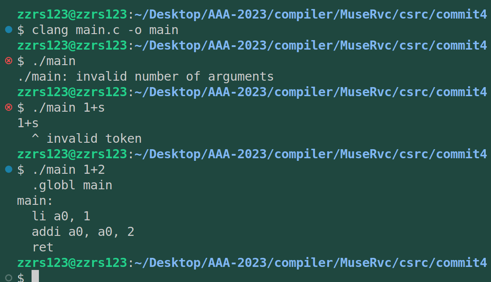
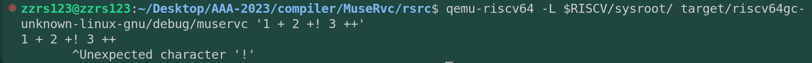

# commit4: 改进报错消息

这部分完成的就是类似平时我们使用clang、rustc、gcc这样的编译器编译、执行文件时错误时返回的错误提示信息。本部分来进行一个初步的整理，并保留拓展性。解析算式部分先不做改动。

## 1. C程序功能




## 2. 阅读C代码

因为没有增加解析新功能，只是在完善报错信息，所以大部分代码跟commit3没有区别，增加的部分如下：

```C
/*main.c*/
//...
// 全局变量指针
// 输入的字符串
static char *CurrentInput;

//...
// 输出错误出现的位置
static void verrorAt(char *Loc, char *Fmt, va_list VA) {
  // 先输出源信息
  fprintf(stderr, "%s\n", CurrentInput);

  // 输出出错信息
  // 计算出错的位置，Loc是出错位置的指针，CurrentInput是当前输入的首地址
  int Pos = Loc - CurrentInput;
  // 将字符串补齐为Pos位，因为是空字符串，所以填充Pos个空格。
  fprintf(stderr, "%*s", Pos, "");
  fprintf(stderr, "^ ");
  vfprintf(stderr, Fmt, VA);
  fprintf(stderr, "\n");
  va_end(VA);
}

// ......
// 字符解析出错，并退出程序
static void errorAt(char *Loc, char *Fmt, ...) {
  va_list VA;
  va_start(VA, Fmt);
  verrorAt(Loc, Fmt, VA);
  exit(1);
}

// Tok解析出错，并退出程序
static void errorTok(Token *Tok, char *Fmt, ...) {
  va_list VA;
  va_start(VA, Fmt);
  verrorAt(Tok->Loc, Fmt, VA);
  exit(1);
}
// ...
int main(int Argc, char **Argv) {

  ...
  // 解析Argv[1]
  CurrentInput = Argv[1];
  Token *Tok = tokenize();
 ......
```

## 3. rust实现

可以看到这部分重新启用了loc字段，上一步中我删除了loc字段，认为它目前没有用。而实际上loc标记字符在原字符流中的位置，便于后续报错确定错误位置。

这个报错系统写的我很难受，主要是这部分实现的C语言很过于抽象，也就是过于利用了C的语言特性，想直接用rust实现确实好麻烦。查看了其他源码（emacc），居然没有实现专门的报错实现，全部依靠Panic!宏。所以还是需要研究一下这个报错。我去参考了rustc。实现的更是不懂。

我尝试将错误信息集成在error宏中，但出现了更多的问题。所以我放弃了这种方式，打算在理解C语言实现逻辑的基础上，自行使用rust的特性来完成。

0422实现效果如下：


但是它实现不了以下的提示（）：


也就是字符流解析为token的过程我没能引入更先进的错误处理。代码如下：

```rust
use std::env;
use std::process::*;
// use std::str::FromStr;

/*=====================================================================
                    Token系统
// ====================================================================== */
#[derive(PartialEq)]
enum TokenKind {
    TkPunct, // 操作符如： + -
    TkNum,   // 数字
    TKEof,   // 文件终止符，即文件的最后
}

enum V<'a> {
    Int(i32),
    Str(&'a str),
}

struct Token<'a> {
    kind: TokenKind,
    value: Option<V<'a>>,
    len: usize,
    loc: usize,
}
static mut CURRENT_INPUT : Option<String> = None;
/*=====================================================================
    error 宏
    在这个宏中，用 $fmt 作为必需的参数。
    然后使用 $arg 变量来捕获任意数量的额外参数。
    使用 eprint! 和 \n 字符将消息输出到 stderr 流中
 ======================================================================*/ 

fn verror_at(loc:usize, err_str:&str) -> (){
    unsafe{
        eprintln!("{}", CURRENT_INPUT.as_deref().unwrap()); // 输出源串
    }
    // 根据loc找到出错位置，另起一行用^+报错消息输出
    let padding = " ".repeat(loc);
    eprint!("{}",padding);
    eprint!("{}", '^');
    eprint!("{}\n", err_str);
}

 /*=====================================================================
    error 宏
    在这个宏中，用 $fmt 作为必需的参数。
    然后使用 $arg 变量来捕获任意数量的额外参数。
    使用 eprint! 和 \n 字符将消息输出到 stderr 流中
 ======================================================================*/ 
macro_rules! error {
    ($fmt:expr $(, $arg:expr)*) => {{
        eprint!(concat!($fmt, "\n") $(, $arg)*);
        exit(1);
    }};
}
macro_rules! errorTok{ 
    ($tok:ident $arg:expr) => {
        verror_at($tok.loc,$arg);
        exit(1);
    };
}


/*=====================================================================
    get_token_number
    返回 TKNUM 的值
 ======================================================================*/ 

fn get_token_number(token: Option<&Token>) -> i32 {

    if let Some(v)= token{
        if v.kind != TokenKind::TkNum{
            // error!("expected a number not a char|string")
            errorTok!(v "expected a number instead of a char|string|EOF");
        } else if let Some(V::Int(n)) = v.value{
            return n;
        }
        errorTok!(v  "expect a number");
    }
    error!("unknown error");
}

/*======================================================================
                    equal: 字符类型/操作符匹配函数
                比较Token的字符value与传入的参数字符串是否相等
                            返回布尔值
====================================================================== */
fn equal(token: &Token, s: &str) -> bool {

    if token.len != s.len(){
        return false;
    } else if let Some(V::Str(st)) = token.value{
        let judge = s == st;
        return judge;
    }
    false
}

/*======================================================================
                    toknize: Token解析主干函数
            从头到尾扫描args[1]，对不同类型的token做不同处理
                rust用match+vec<T>实现起来是相当优雅的
====================================================================== */
fn tokenize(arg: &mut str) -> Vec<Token> {
    let mut tokens = Vec::new();
    let mut start = 0;
    // arg.char_indices()同时得到索引和字符，对得到的字符用match进行处理
    for (i, c) in arg.char_indices() {
        match c {
            // 处理空白字符
            c if c.is_whitespace() => {
                start = i + 1;
            },
            // 解析操作符
            // 特点是长度一定为1
            '+' | '-' => {
                let str1=&arg[start..=i] ;
                let token = Token {
                    kind: TokenKind::TkPunct,
                    value: Some(V::Str(str1)),
                    loc: i,
                    len: 1, // 操作符长度为1
                    // sss: Some(str1), // 将操作符解析到 sss 字段
                };
                tokens.push(token);
                start = i + 1;
            },
            // 解析数字
            '0'..='9' =>  {
                let mut end = i;
                while let Some(c) = arg.chars().nth(end) {
                    if c.is_digit(10) {
                        end += 1;
                    } else {
                        break;
                    }
                }
                let numeric = arg[start..end].parse::<i32>().ok();
                let token = Token {
                    kind: TokenKind::TkNum,
                    value: Some(V::Int(numeric.unwrap())),
                    loc: i,
                    len: end - start,
                    // sss:None
                };
                tokens.push(token);
                start = end;
            }
            _ => {
                // error!("Unexpected character '{}'", c);
                // errorTok!()
            }
        }
    }
    let eof_token = Token {
        kind: TokenKind::TKEof,
        value: None,
        loc: arg.len(),
        len: 0,
        // sss:None,
    };
    tokens.push(eof_token);
    tokens
}

/*======================================================================
                        main: 主干函数
                接收目标字符串，接入Token处理为RISC-V汇编
====================================================================== */
fn main() {
    // 从命令行参数中获取传入的参数
    let mut args: Vec<String> = env::args().collect();

     // 判断传入程序的参数是否为2个，args[0]为程序名称，args[1]为传入的第一个参数
    if args.len() != 2 {
        // 异常处理，提示参数数量不对。
        // 封装为error宏
        error!("{}: invalid number of arguments", &args[0]);
    }
  
    // 接下来引入Token解析系统，将数字和运算符处理为token，空格滤除
    let total_str = args[1].clone();
    unsafe {
        CURRENT_INPUT = Some(total_str);
    }
    let tok = tokenize(args[1].as_mut_str());
    // VerrorAt(1,"tskldjf");
  
    // let mut iter = tok.chars();//创建了一个字符迭代器
    // let mut p = iter.next();//获取其第一个字符
    let mut iter = tok.iter();// 创建了一个迭代器

    let mut p = iter.next();//获取其第一个token
    // 声明全局main段，也是程序入口段
    println!("  .globl main");
  
    // main段标签
    println!("main:");
  
    // li为addi别名指令，加载一个立即数到寄存器中
    // 这里我们将算式分解为 num (op num) (op num)... 的形式
    // 所以先将第一个 num 传入a0
    let c = p.unwrap();
    // errorTok!(c "sdfsdf");
    let num = get_token_number(Some(c));
    println!("  li a0, {}", num);

    while let Some(op) = iter.next() {
        // println!("{}",op.loc);
        match op.kind{
            TokenKind::TKEof    => {
                break // 这里不能error！，直接退出不能打印ret
            }
            TokenKind::TkPunct  => {
                if equal(op, "+"){
                    p = iter.next(); // 跳过 + 号
                    println!("  addi a0, a0, {}", get_token_number(Some(p.unwrap())));
                } else {
                    p = iter.next(); // 跳过 - 号
                    println!("  addi a0, a0, -{}", get_token_number(Some(p.unwrap())));
                }
        
            }
            TokenKind::TkNum    => {
                error!("unexpected num!")
            }
        }
    }
    println!("  ret");
}


```

这方面非功能性的错误处理代码写的很难受，再看看rustc源码和各方面资料来进行优化吧，不能卡在这里，继续向后进行吧。


## 4. 修改优化

因为实在忍不了这种半实现的功能，所以04/22下午忍着饥饿把error!宏完善了。上面字符流扫描的错误终于能够进行错误提示了：



代码修改如下：

```rust
use std::env;
use std::process::*;
// use std::str::FromStr;

/*=====================================================================
                    Token系统
// ====================================================================== */
#[derive(PartialEq)]
enum TokenKind {
    TkPunct, // 操作符如： + -
    TkNum,   // 数字
    TKEof,   // 文件终止符，即文件的最后
}

enum V<'a> {
    Int(i32),
    Str(&'a str),
}

struct Token<'a> {
    kind: TokenKind,
    value: Option<V<'a>>,
    len: usize,
    loc: usize,
}
static mut CURRENT_INPUT : Option<String> = None;
/*=====================================================================
    error 宏
    在这个宏中，用 $fmt 作为必需的参数。
    然后使用 $arg 变量来捕获任意数量的额外参数。
    使用 eprint! 和 \n 字符将消息输出到 stderr 流中
 ======================================================================*/ 

fn verror_at(loc:usize, err_str:&str) -> (){
    unsafe{
        eprintln!("{}", CURRENT_INPUT.as_deref().unwrap()); // 输出源串
    }
    // 根据loc找到出错位置，另起一行用^+报错消息输出
    let padding = " ".repeat(loc);
    eprint!("{}",padding);
    eprint!("{}", '^');
    eprint!("{}\n", err_str);
}

 /*=====================================================================
                error 宏
    尝试了很多方式，最后还是返璞归真复用error!宏
    在前面的error版本中直接向下增加就可以，但总感觉写的不够好。
    因为C中使用变参函数，Rust不支持，所以寻求使用宏匹配来解决
    跟C有点不同，C中区分了两种错误消息宏
    第一种处理：字符串解析为token过程中的errorAT，
              这个使用error宏的第一个匹配逻辑就可以达到同样效果
    第二种处理：解析token流时的错误errorTok，
              使用输入为token类型的第二个匹配逻辑
 ======================================================================*/ 
macro_rules! error {
    ($tok:ident, $msg:expr) => {
        verror_at($tok.loc, $msg);
        exit(1);
    };
    // 使用 format! 宏将 $c 的值插入到 $fmt 中，生成新的字符串 message。
    // 最后，我们将 $i 和 &message 一起传递给 verror_at 函数进行错误处理。
    ($i:ident, $fmt:expr, $c:expr) =>{{
        // let str = concat!($fmt, $c:expr) ;
        let message = format!($fmt, $c);
        verror_at($i,&message);
        exit(1);
    }};
    ($fmt:expr $(, $arg:expr)*) => {{
        eprint!(concat!($fmt, "\n") $(, $arg)*);
        exit(1);
    }};

}
 /*=====================================================================
    errorTok 宏
    将token解析错误的位置标注出来进行输出。
    这里跟C有点不同，C中区分了两种错误消息宏
    第一种处理：字符串解析为token过程中的errorAT，这个使用error宏就可以达到同样效果
    第二种处理：解析token流时的错误errorTok，单独实现了一个输入为tok的一个宏
 ======================================================================*/ 
// macro_rules! errorTok{ 
//     ($tok:ident $arg:expr) => {
//         verror_at($tok.loc,$arg);
//         exit(1);
//     };
// }


/*=====================================================================
    get_token_number
    返回 TKNUM 的值
 ======================================================================*/ 

fn get_token_number(token: Option<&Token>) -> i32 {

    if let Some(v)= token{
        if v.kind != TokenKind::TkNum{
            // error!("expected a number not a char|string")
            error!(v,"expected a number instead of a char|string|EOF");
        } else if let Some(V::Int(n)) = v.value{
            return n;
        }
        error!(v,"expect a number");
    }
    error!("unknown error");
}

/*======================================================================
                    equal: 字符类型/操作符匹配函数
                比较Token的字符value与传入的参数字符串是否相等
                            返回布尔值
====================================================================== */
fn equal(token: &Token, s: &str) -> bool {

    if token.len != s.len(){
        return false;
    } else if let Some(V::Str(st)) = token.value{
        let judge = s == st;
        return judge;
    }
    false
}

/*======================================================================
                    toknize: Token解析主干函数
            从头到尾扫描args[1]，对不同类型的token做不同处理
                rust用match+vec<T>实现起来是相当优雅的
====================================================================== */
fn tokenize(arg: &mut str) -> Vec<Token> {
    let mut tokens = Vec::new();
    let mut start = 0;
    // arg.char_indices()同时得到索引和字符，对得到的字符用match进行处理
    for (i, c) in arg.char_indices() {
        match c {
            // 处理空白字符
            c if c.is_whitespace() => {
                start = i + 1;
            },
            // 解析操作符
            // 特点是长度一定为1
            '+' | '-' => {
                let str1=&arg[start..=i] ;
                let token = Token {
                    kind: TokenKind::TkPunct,
                    value: Some(V::Str(str1)),
                    loc: i,
                    len: 1, // 操作符长度为1
                    // sss: Some(str1), // 将操作符解析到 sss 字段
                };
                tokens.push(token);
                start = i + 1;
            },
            // 解析数字
            '0'..='9' =>  {
                let mut end = i;
                while let Some(c) = arg.chars().nth(end) {
                    if c.is_digit(10) {
                        end += 1;
                    } else {
                        break;
                    }
                }
                let numeric = arg[start..end].parse::<i32>().ok();
                let token = Token {
                    kind: TokenKind::TkNum,
                    value: Some(V::Int(numeric.unwrap())),
                    loc: i,
                    len: end - start,
                    // sss:None
                };
                tokens.push(token);
                start = end;
            }
            _ => {
                let loc_char: usize = i;
                error!(loc_char,"Unexpected character '{}'", c);
                // errorTok!()
            }
        }
    }
    let eof_token = Token {
        kind: TokenKind::TKEof,
        value: None,
        loc: arg.len(),
        len: 0,
        // sss:None,
    };
    tokens.push(eof_token);
    tokens
}

/*======================================================================
                        main: 主干函数
                接收目标字符串，接入Token处理为RISC-V汇编
====================================================================== */
fn main() {
    // 从命令行参数中获取传入的参数
    let mut args: Vec<String> = env::args().collect();

     // 判断传入程序的参数是否为2个，args[0]为程序名称，args[1]为传入的第一个参数
    if args.len() != 2 {
        // 异常处理，提示参数数量不对。
        // 封装为error宏
        error!("{}: invalid number of arguments", &args[0]);
    }
  
    // 接下来引入Token解析系统，将数字和运算符处理为token，空格滤除
    let total_str = args[1].clone();
    unsafe {
        CURRENT_INPUT = Some(total_str);
    }
    let tok = tokenize(args[1].as_mut_str());
    // VerrorAt(1,"tskldjf");
  
    // let mut iter = tok.chars();//创建了一个字符迭代器
    // let mut p = iter.next();//获取其第一个字符
    let mut iter = tok.iter();// 创建了一个迭代器

    let mut p = iter.next();//获取其第一个token
    // 声明全局main段，也是程序入口段
    println!("  .globl main");
  
    // main段标签
    println!("main:");
  
    // li为addi别名指令，加载一个立即数到寄存器中
    // 这里我们将算式分解为 num (op num) (op num)... 的形式
    // 所以先将第一个 num 传入a0
    let c = p.unwrap();
    // errorTok!(c "sdfsdf");
    let num = get_token_number(Some(c));
    println!("  li a0, {}", num);

    while let Some(op) = iter.next() {
        // println!("{}",op.loc);
        match op.kind{
            TokenKind::TKEof    => {
                break // 这里不能error！，直接退出不能打印ret
            }
            TokenKind::TkPunct  => {
                if equal(op, "+"){
                    p = iter.next(); // 跳过 + 号
                    println!("  addi a0, a0, {}", get_token_number(Some(p.unwrap())));
                } else {
                    p = iter.next(); // 跳过 - 号
                    println!("  addi a0, a0, -{}", get_token_number(Some(p.unwrap())));
                }
        
            }
            TokenKind::TkNum    => {
                error!("unexpected num!")
            }
        }
    }
    println!("  ret");
}


```

行了，可以进行推送了。
