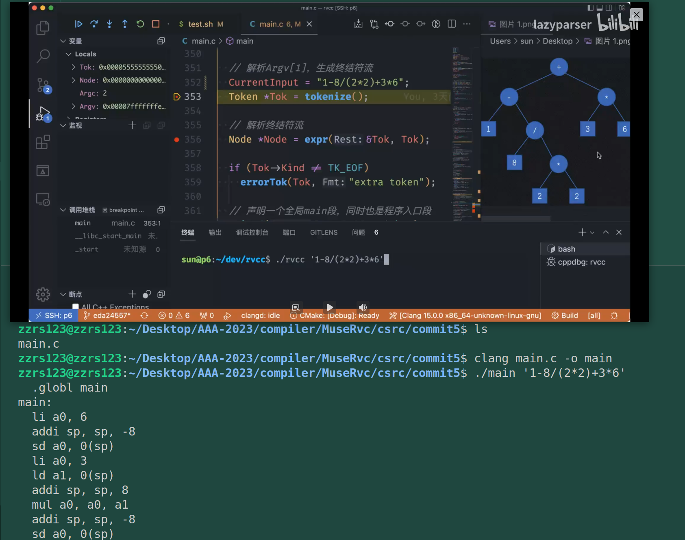
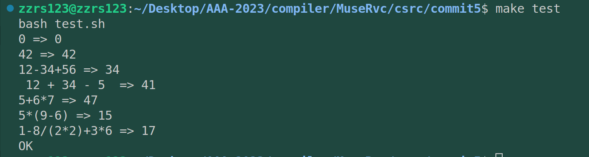
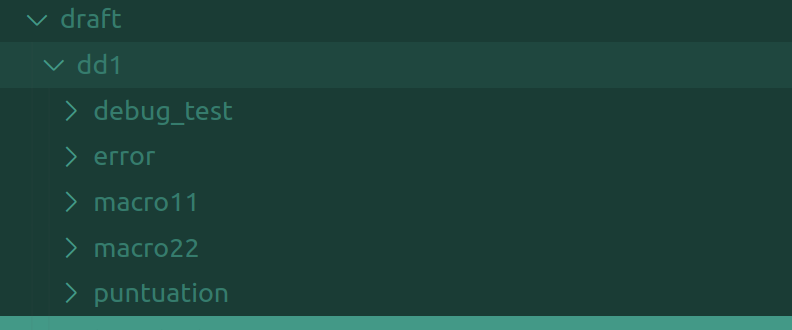
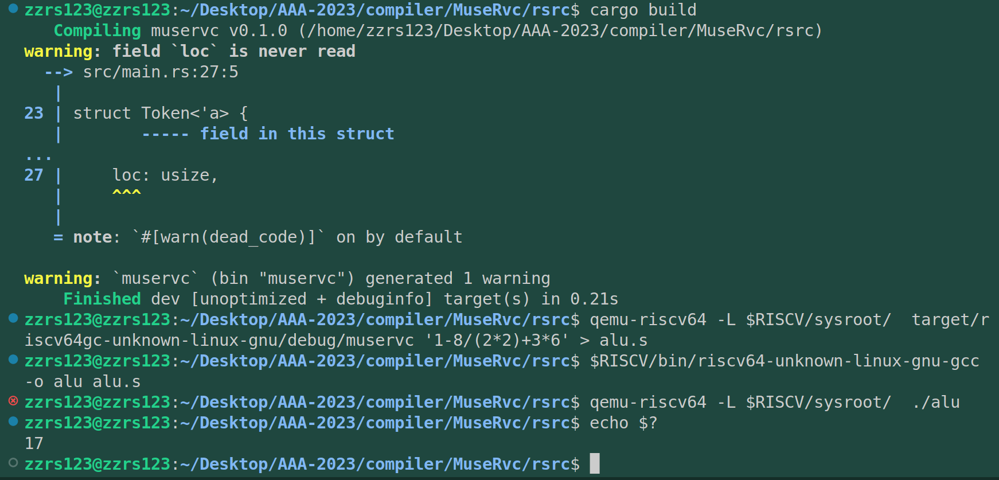
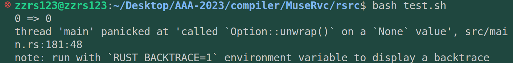
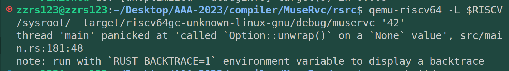
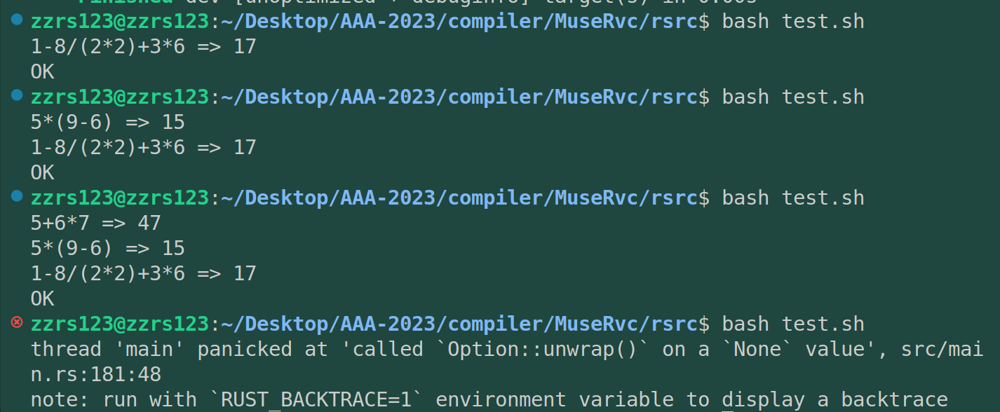
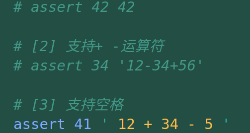

# commit5: 支持* / ()运算符

到这部分结束，算式的大体就能够确定了，这部分将引入AST，将一个算式解析为AST抽象语法树。

## 1. C程序功能

加入乘除法和括号，解析对象增加，生成汇编的语句种类也增加了。具体执行效果如下图所示：





## 2. 阅读C代码

这部分开始将代码分为三部分：

* `tokenize()` 函数代表的**词法分析**，将字符流处理为token
* 本部分要加入的 `expr()`函数的**语法分析**
* 本部分要整理的 `genExpr()`的**代码生成**部分

### 2.1 词法分析

由于增加了乘除*/，原本+-一起处理的实现就可以考虑其他的实现方式：

在C语言中，ispunct函数返回true的输入字符包括ASCII表中所有的标点符号。具体来说，包括以下字符：

```
! " # $ % & ' ( ) * + , - . / : ; < = > ? @ [ \ ] ^ _ ` { | } ~
```

除此之外，ispunct函数还会根据当前的区域设置返回其他字符，因为不同的语言和地区对于标点符号的定义可能有所不同。

在Rust中，is_ascii_punctuation()方法返回true的输入字符与ASCII表中的所有标点符号相同。具体来说，包括以下字符：

```
! " # $ % & ' ( ) * + , - . / : ; < = > ? @ [ \ ] ^ _ ` { | } ~
```

值得注意的是，is_ascii_punctuation()方法只能判断ASCII字符是否为标点符号。对于Unicode字符，可以使用is_punctuation()方法来判断是否为标点符号，该方法在标准库的char类型中定义。

### 2.2 语法分析

语法分析要构造AST抽象语法树，首先要设置一个语法规则。

```C
expr = mul ("+" mul | "-" mul)*
mul = primary ("*" primary | "/" primary)*
primary = "(" expr ")" | num
```

1. 设置表达式是由多个乘数相加得到的。
2. 乘数本身是由基数相乘或相除得到的。
3. 基数是一个括号内的表达式或者一个数字

这样表达式->乘数->基数的优先级就是依次递增。构建出的AST树也正能反映这一点，最下面的节点优先级最高。

从实现上，这三部分是自顶向下的，即expr->mul->num三层，底层语法解析完毕返回上层继续解析，最后expr解析完成返回的就是一个AST树。

### 2.3 代码生成

这部分基本上虽然只增加了几个符号，但是对于算式逻辑又增加了很多，而对于生成的汇编来说，又增加了栈操作指令、乘法指令、除法指令的输出。

具体来说，代码生成部分是遍历一遍这个AST树，对于不同的节点取出其中的值放入不同的输出语句中。中间存储结构是一个栈。达到生成汇编的目的。

---

总的来说，想用rust复现这部分代码的困难还是有的。

## 3. rust 实现

先要理解递归向下的算法。（虽然视频里没有说，但是确实是递归向下）。

> 2023/04/24 阅读rcore源码，发现有一种更好的提示错误的方式，但暂且不更改自己的错误处理模块，后续优化再来做。

### 3.1 第一版实现：仅通过部分针对性算例

这一步的实现我使用了很多rust的高级特性（比如Box、Result等），在不上传的draft文件夹下尝试了很多语法特性和小模块的编写。因此写的比较慢，不过写完感觉挺满意的。



---

运行结果如下：可见正确执行了相关汇编程序，得到正确的运算结果



---

一时兴起想把test.sh用起来跑跑测例，跑起来发现有大问题。具体表现为：







也就是说，这部分我的实现，只能支持部分的算例，更具体地说，只能支持* / ()运算符，而对于下面的算例统统不行：



---

仔细一查发现在tokenize中出了问题，大概之前写的就有问题（因为这次step4没有修改这部分的功能代码）。Debug刚装上就派上了用场。

> 2023/04/25晚，初步排查，发现是tokenize的数字解析部分的指针移动出了问题，明天再改吧。
>
> 总之step4已经到来了是吧，先推送。


### 3.2 第二版实现：
