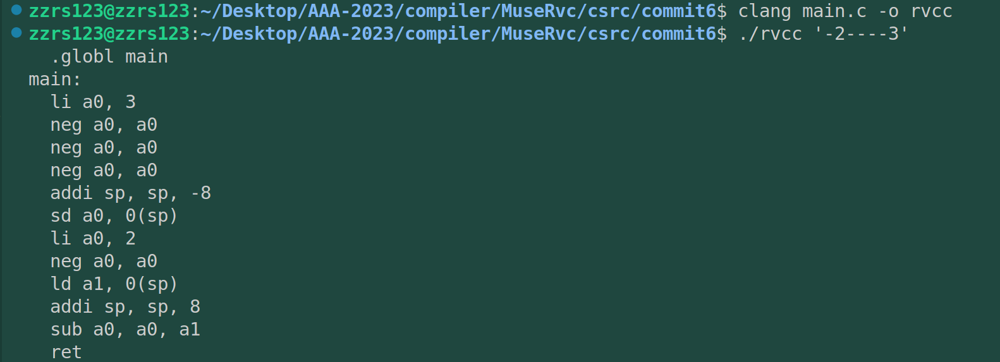
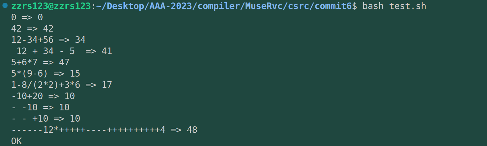
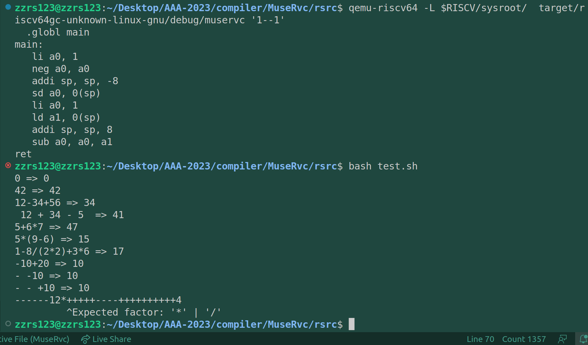
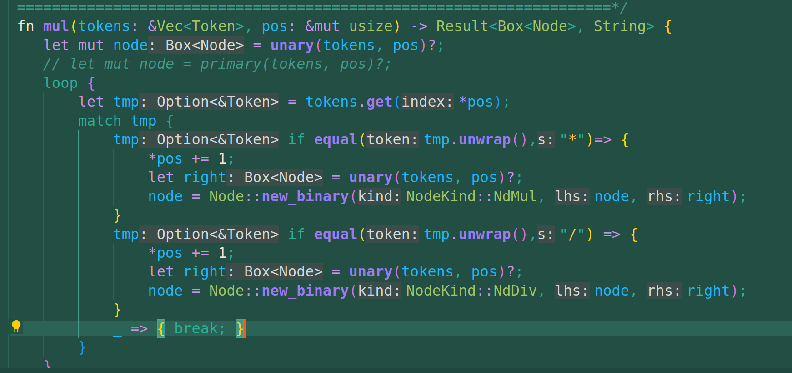

# commit6: 支持一元运算符 + -

## 1. C程序功能





---

可见，能够识别特定的 '-' 号作为负号来对后面的目标数字取反，正数保留符号。

## 2. 阅读C程序

词法部分没什么改变，主要是文法和代码生成。

### 2.1 文法推导式

增加了一个规则：

```rust
expr = mul ("+" mul | "-" mul)*
mul = unary ("*" unary | "/" unary)*
unary = ("+" | "-") unary | primary
primary = "(" expr ")" | num
```

也就是说：

* 表达式可能由两个乘数加减得到（没变）
* 乘数是一元运算数(unary)乘除得到的
* 一元运算数(unary)前面可能有加号和负号+primary
* primary：原先的基数

对于'-2----3'这个输入来说。expr->mul->unary，unary与原先的expr、mul、primary结构都不太相同。因为一元运算可以视为一个单叉树。

这里有一个问题就是，负号和减号如何区分呢？也很简单，数字之后的'-'就是减号。

## 3. rust实现

因为前面的框架已经很清晰了，所以这部分实现起来很快，但是并没有达成理想效果，反倒说自己的程序overflow了，所以我一脸蒙蔽的打开debug。在下面这段代码中的 `let judge = s == st;`报错，如果输入是'1--1'，就是在第一次比较减号时调用这里导致的崩溃。

```rust
fn equal(token: &Token, s: &str) -> bool {

    if token.len != s.len(){
        return false;
    } else if let Some(V::Str(st)) = token.value{
        let judge = s == st;
        return judge;
    }
    false
}

```

同样的，这也是一段早就已经写好的函数，step4中甚至就没有更改它。

> 2023/04/26，我猜测是与token的生命周期以及引用解引用有关。

经过测试，我觉得还是代码逻辑问题，测试分为debug和更换输入测试用例两种，更换用例为：+1， +1++1，+1++1-1都是正常的，而 -1，--1，+-1，+1--1，+1+-1（而+1-+1正常）程序溢出崩溃。进而猜测不是程序调用逻辑本身导致的栈溢出，而是-号的逻辑设计问题。

所以我立马把问题定位到了新增的文法解析模块unary中，我认为match代码块隐含着很多我不可控的因素，所以我直接改写为if语句。重新编译后上述测试用例全部通过。

> 所以原代码块的问题我还是不清楚怎么出错的，留待后观。

去除程序中的调试输出（主要是测试词法模块生成的token是否正常）后，运行test.sh来查看结果：



可见属于step5的四个测试中前三个通过了，而最后一个没有通过。并且触发了我的错误提示系统，说明是一个可控的程序逻辑，所以对这个bug还是比较放心的。

然后我发现这个提示是错误的，这段error!提示是在primary函数中，它应当是" expected a expression or a number"。而不是上图提示的那样"*"或"/"，可能是编写的时候考虑失误。

其次，用rust-debug走了一遍，发现primary在错误的时候被调用（也就是*号解析之后），应当由unary函数调用primary，而不是mul函数来调用primary。

所以可以定位到是这里的问题：



上图是已经修改过了，原本爆出error!的代码是match语句中调用的是primary而不是图中已经修改过的unary。

> 那么是否上图处的break是否应当替换为error宏呢？答案是否定的，因为不满足*和/的运算符（比如 '-'）并不能直接让程序崩溃，而是break出match程序块进入下一层调用。所以此处还是保留break不采用error宏。

至此所有可以预想的问题都已经解决。
