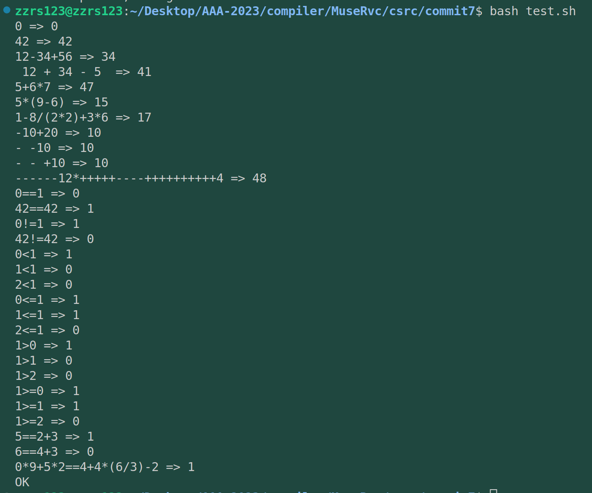

# commit7: 支持 == !=  <= >=

## 1. C程序功能



## 2. 阅读C程序

### 2.1 词法

由于引入了长度为2的运算符，词法部分需要修改。增加一个函数来替换掉之前的 `is_ascii_puntuation()`函数，也可以说是扩充原先的函数功能。也就是 `read_punct()`函数。

这里感觉C程序版本写的挺好的。增加的函数封装的很好。不过C语言从开始就是用链表在实现，我在担心能否用rust实现出相同的效果。我其实可以不增加封装，采用类似于多位数字的解析方式将多位的字符解析出来。

不过我还是使用函数封装完成了这个实现：

```rust
fn read_punct(ptr: &str) -> (Option<&str>, usize) {
    let mut len = 0;
    if let Some(c1) = ptr.chars().next() {
        len += 1;
        if let Some(c2) = ptr.chars().nth(1) {
            len += 1;
            match (c1, c2) {
                ('=', '=') | ('!', '=') | ('<', '=') | ('>', '=') => return (Some(&ptr[..2]), len),
                _ => if c1.is_ascii_punctuation() {
                    return (Some(&ptr[..1]), 1);}
            }
        } 
    }
    (None, 0)
}
```

不过不再需要startwith了。不过发现rust字符串自带一个startwith。

ok，下面就是对词法部分的测试：主要集中于原有测例能否正常生成汇编，以及新增部分的测例能否被作为token正常打印。

一些比较正常的测例还算正常，不过在进行到   1-1+2* (3+4/2)  时，上面这个read函数就会进入None中，让我觉得很麻烦。

于是先把写到tokenize函数中去。虽然tokenize函数复杂度继续上升，但是相较于原实现并没有复杂很多。

> 在这次对词法的修改中我产生了一个想法：
>
> * 将操作符放到一起取个名字，就像Node结构体中对操作符的名字一样
> * 这样就可以避免返回一个近似于裸的字符串，而是一个结构体的成员。
>
> 想法听起来虽然很棒，也能将增加字符这件事情变得更容易拓展，但是属于程序大改，目前先不进行这件事。

### 2.2 文法

其次就是文法，新增了操作符也就新增加了语义信息。语法树解析也要进行相应的增加。

增加解析方案，其实就是增加解析函数。而增加解析函数需要理解在哪里添加解析函数，这个增加位置就取决于运算符的优先级。很显然，这次引入的!= ，== 优先级低于此前所有运算符，应当位于Expr函数之下、mul之上。


### 2.3 代码生成

 如果把文法写好，那么代码生成就很简单，因为原有架构是很方便继续扩充的，而且每个match分支做的事情也就只是println。所以这部分比较好写。


## 3. rust实现

上面第2部分写了很多，就不介绍了。
