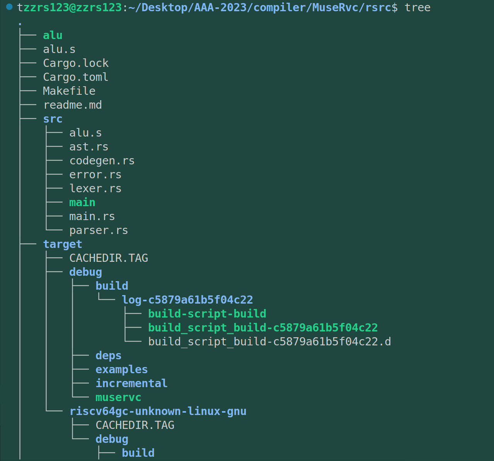
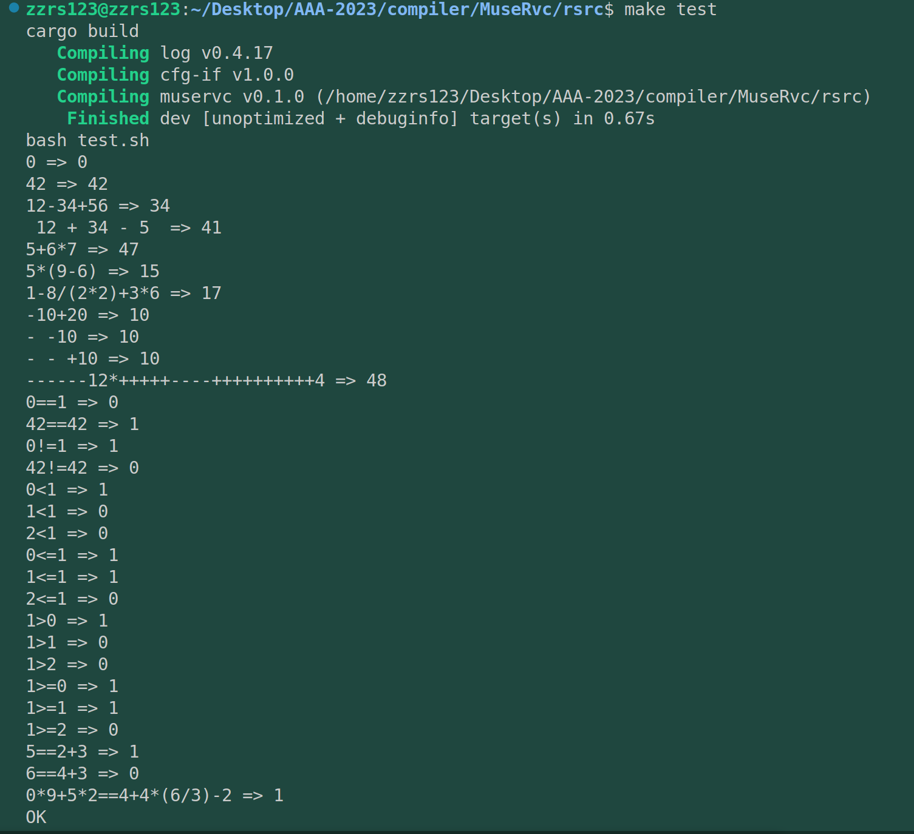

# commit8: 划分为多个文件

## 1. 划分文件

目前main.rs已经将近700行，翻阅起来已经很不容易了。以后功能会越来越复杂，所以分成多个文件是大势所趋。功能上并没有新增。

其实原有部分还是非常明显的，main函数是入口，词法分析、文法分析、代码生成是很明显的四个部分。（其中代码生成之后可能要拆分为中间代码和后端两大部分，毕竟后端优化是一个重头戏）。

这里主要的问题是，这也是我第一次进行rust的多文件项目编写（rcore是同时进行的，而且不是自己编写）。我比较适应C语言的多语言编写，那种一个.c文件一个.h文件的模式个人认为还是比较易于理解的。而rust的多文件模块更类似于python，文件直接可以import（这一点跟Java也有点不同）。

## 2. C语言划分实现


## 3. rust划分实现

我的初步想法是：

* src/main.rs ： 只存放main函数
* src/error.rs： 存放错误处理
* src/ast.rs：管理AST的数据结构以及它的impl函数
* src/lexer.rs： 词法分析
* src/parser.rs：文法/语法分析
* src/codegen.rs：代码生成（后续可能会变成文件夹）。虽然不是很喜欢这个codegen名字，但是大家都这么叫。
* test.sh：编译、运行、测试项目的脚本
* Makefile：更上一层的编译控制

划分的过程中的主要挑战是rust的各个语法对象的访问权限，也就是public、private这种概念。我得稍微复习一下rust的多文件项目组织以及模块这方面的知识。这部分的收获和整理见第4部分的总结。

最终效果实现：



test.sh没有在图片中截屏到。

用 `make test` 运行可以查看效果：（简单写的makefile，很丑陋，不是很熟悉rust的makefile怎么写，其实就是套了一层皮的 `cargo build`、`rm -rf`、`bash test.sh`）



## 4. [附]rust多文件组织

### 4.1 rust模块mod

在 Rust 中，文件可以组织成模块，以便更好地管理代码并将其组织成可复用的块。模块可以包含结构体、枚举、函数等等，并且可以通过 `use` 关键字来在不同的模块之间进行访问。

一个 Rust 模块通常由两部分组成：模块声明和模块实现。模块声明告诉 Rust 编译器哪些模块可用，并定义了模块的名称、路径和可见性。模块实现包含模块中定义的所有代码。

在 Rust 中，通常使用 `mod` 关键字来声明一个模块。例如：

```rust
mod my_module {
    // module implementation goes here
}
```

在模块中，可以定义结构体、枚举、函数等。这些定义可以在模块的范围内使用，也可以在模块外使用，但需要使用 `use` 关键字来引入模块。

例如，如果在模块 `my_module` 中定义了一个结构体 `MyStruct`，则可以在同一文件中的其他模块中使用它：

```rust
mod other_module {
    use crate::my_module::MyStruct;

    // use MyStruct here
}
```

### 4.2 rust多文件

在 Rust 中，一个项目可以由多个文件组成，这些文件可以放在同一个目录中，也可以分布在不同的目录中。对于一个具有多个文件的 Rust 项目，通常会有一个主入口文件，该文件中包含项目的主函数和模块声明。

在组织多文件 Rust 项目时，通常会将不同的模块放在不同的文件中。例如，一个名为 `my_project` 的 Rust 项目的文件结构可能如下所示：

```rust
my_project/
├── src/
│   ├── main.rs
│   ├── module1.rs
│   ├── module2.rs
│   ├── module3/
│   │   ├── mod.rs
│   │   └── module3.rs
│   └── module4/
│       ├── mod.rs
│       └── module4.rs
├── Cargo.lock
└── Cargo.toml
```

在这个例子中，`src` 目录下包含了所有 Rust 代码，而每个模块都被放置在自己的文件中。模块 `module3` 和 `module4` 分别放置在自己的目录中，这样可以更好地组织代码并避免文件名冲突。

在 `src/main.rs` 文件中，您可以声明和引用所有需要的模块：

```rust
mod module1;
mod module2;
mod module3;
mod module4;

fn main() {
    // use module1, module2, module3, module4 here
}
```

在这个例子中，`main.rs` 文件声明了 `module1`、`module2`、`module3` 和 `module4` 四个模块，因此它们都可以在 `main()` 函数中使用。

### 4.3 一些具体实践上的问题

这部分结合具体代码来看，也就是rsrc/src下的代码来看。

其实哪部分分到哪个文件是很清楚的，因为原本在main.rs下就很清楚各个模块之间的联系和独立性，主要的问题在于它们的互相引用。

我首先摆平main.rs中的模块调用错误，然后解决各个分模块之间的调用错误，最后解决error宏中还调用了其他实体函数导致在引用模块中无法展开的问题——只需要都把引用过来。有什么经验倒是谈不上，看成品文件夹即可知道正确的方式是什么了，中间的一些修改和尝试就不足道了。

最后提的一点是：在划分文件的过程中，突然有了更多面向对象的想法，比如突然发现自己的AST树节点部分的impl函数居然没有使用self特性，以及每个模块文件下还是更像C的模块文件，而不是java的模块文件，让模块文件java类化、面向对象化是后面软件工程优化的一个方向。
