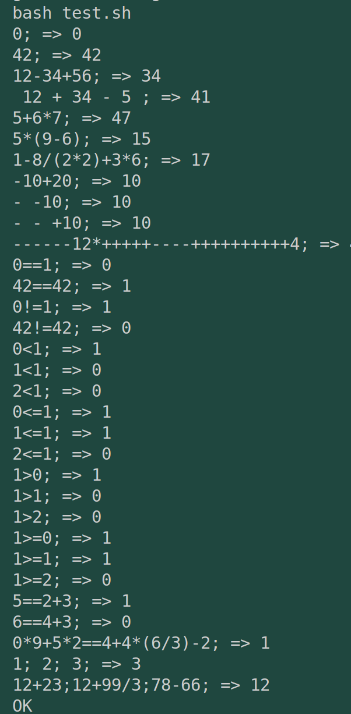
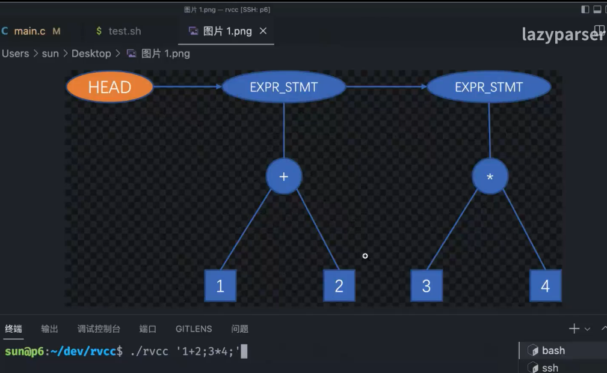
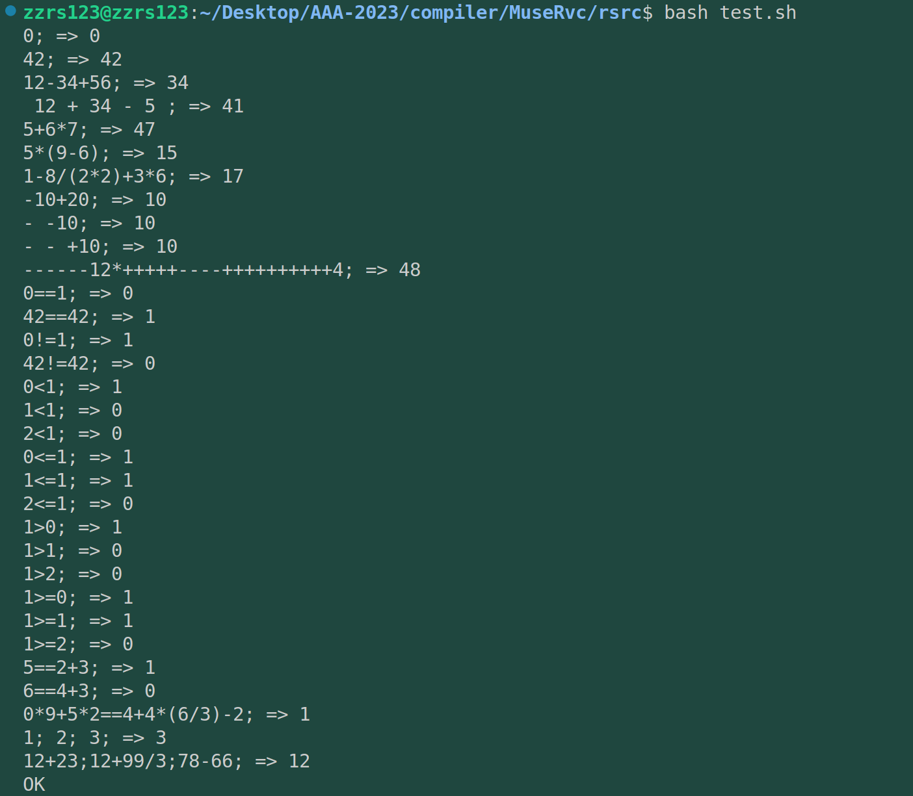

# commit9: 支持;分割语句

## 1. 程序功能



支持分号。

## 2. 阅读C程序

首先只看效果，盲猜修改的是哪一部分？

* 词法分析lexer，增加了分号;的解析。
* 文法分析parser，需要增加推导式，应该是高于等于关系的推导式（优先级最低）
* 代码生成，解析AST树的时候需要忽略分号，我觉得这部分需要仔细琢磨一下。
* main函数不需要修改，但是我突然想起来我本来的main中对代码生成的包装并不好，一些语句还放在main中，这太不合适了。
  > step8中已经完成代码生成的封装，将codegen作为codegen.rs的顶层函数。
  >

那么下面开始阅读C实现。

### 2.1 词法

这里我的理解有误，原有词法分析代码足够解析;分号。lexer不需要修改。

### 2.2 文法

这部分实现的语法树如下：所以分号是要高于expr的分号可以统领（实际上是分割）多个表达式。



至于推导式部分，在expr表达式之上又增加了几个推导：

```C
program = stmt*
stmt = exprStmt
exprStmt = expr ";"
expr = equality
```

也就是说，程序是由一个或多个语句组成，语句由表达式组成（目前只有表达式），表达式由表达式+分号组成，再下面的表达式推导跟此前完全相同。

### 2.3 代码生成

其实问题更大的是代码生成。如何在这部分rust的严格所有权的约束下来实现链表功能的平替。

### 2.4 rvcc.h

在AST的节点种类也就是NodeKind中增加表达式种类ND_EXPR_STMT，其次在ast的Node结构体中增加next成员用于构建表达式节点链表。（这里我的设想是可以考虑继续使用动态数组Vec来平替链表，也可以在Node结构体中进行一样的操作，也就是加入next成员）。

### 2.5 parse.c

同2.2文法部分，代码具体没什么好说的。

## 3. rust实现

### 3.1 rust-test

这里我突发奇想，想尝试一下rust 的测试，就好像C语言项目（osgui）中每个模块文件开头我放入一个test函数，测试模块内的功能正常，这个需要探索一下。

**但是不能正常执行，因为是交叉编译环境吧。不能直接cargo test，这一点mark后面来解决。**

> 参考资料：[Rust程序设计第11章——测试](https://rustwiki.org/zh-CN/book/ch11-01-writing-tests.html)

### 3.2 文法分析：parser.rs

首先需要更改文法分析的入口顶层函数parser，将其中直接调用expr函数改为更封装的函数stmt语句分析函数。这里出于内存方面的考虑，我考虑使用链表而不是vec动态数组。

> 2023/05/05 最终实现，这期间感觉自己的实现，内存占用会很大，因为tokenize词法分析使用的是一个大数组Vec（而不是链表）；AST树的构建使用的是Box Node 。在ast数据结构中引入一个.next成员可能会缓解这一点，一直使用vec可能不利于后续编译大型软件的尝试。
>
> 不过.next在后续codegen.rs的改写中对我的折磨很大。在rust实现中有很多所有权的问题，这是C语言永远不可能涉及的。

---

接着是stmt语句分析函数，这个函数后面的拓展空间很大，可以解析程序文件中的各种语句，目前只是表达式语句（还是常量表达式语句）。未来的雏形可能如下：

```rust
fn stmt(tokens: &Vec<Token>, pos: &mut usize) -> Result<Box<Node>, String> {
    if *pos >= tokens.len() {
        return Err(String::from("Unexpected end of input"));
    }
    let token = &tokens[*pos];
    match token.kind {
        TokenKind::Identifier => {
            // 处理变量声明语句
            // ...
        }
        TokenKind::If => {
            // 处理条件语句
            // ...
        }
        TokenKind::While => {
            // 处理循环语句
            // ...
        }
        // 其他语句类型
        // ...
        _ => {
            return Err(format!("Unexpected token: {:?}", token));
        }
    }
}
```

**stmt现在只有表达式语句，所以直接 程序体中写 expr_stmt 语句即可**

### 3.3 面向对象的初步探索

在step7--commit8中重构项目的时候我就在想，rust是支持面向对象的，而个人感觉面向对象会让整个项目架构更整洁，调用逻辑也会更倾向于模块化和黑匣子化（大概是这么个意思），所以从本step的重头戏parser先做起。

我觉得不能把这件事推到后面去做，越到后面需要改写的代码越多。想把整个代码面向对象化，再在这个基础上继续扩写。

> 2023/05/05 最终实现，还是没有面向对象，先用类C风格实现吧，再多看看优秀rust源码，功力还是不深。

### 3.4 代码生成：codegen.rs

这部分花费精力要超过文法分析，五一期间的停摆的部分原因也是这部分遇到的困难。

关键点是在于rust中安全的使用链表，rust的安全性也局限了我，不能像在C语言中那样使用next成员。

总之看整体实现吧。在推送之前，我再检查一下整个项目。


