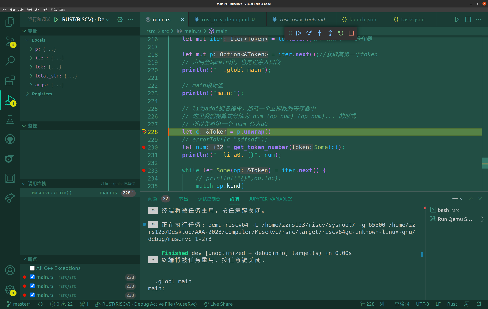

# 交叉调试配置

鉴于 step3/commit4 中自己 debug rust in riscv 的窘况。决定在vscode环境中配置rust在riscv架构的交叉调试环境。

由于编译器是一个用户级程序，网上很多面向 riscv架构rust编写的rcore和xv6的教程都不适用于自己的问题。于是从C本机环境调试->C交叉环境调试->rust本机环境调试->rust交叉环境调试 的过程逐步摸索自己的环境应该怎么配置，lldb如何连接qemu。

今天，2023/04/23 终于搞定了。

>  参考资料：
>
> - [blog1:VSCode 调试 RISC-V 程序](http://lifeislife.cn/2021/08/23/VSCode%E8%B0%83%E8%AF%95%E7%A8%8B%E5%BA%8F/)

## 1. riscv64-toolchains

安装这个交叉环境工具链，自己已经搞过了，具体见 `rust_riscv_tools.md`。

## 2. vscode 插件

* rust-analyzer插件
* codelldb插件

## 3. task.json

在vscode中建立任务，**主要目的是启动qemu**的调试模式。再手动按下自己的调试按钮，实现两边的连接。

```json
{
    "version": "2.0.0",
    "tasks": [
        {
            // 编译当前代码
            "type": "shell",
            "label": "Build Rust In Riscv",
            // 编译器的位置
            "command": "cargo build",
            // 当前工作路径：执行当前命令时所在的路径
            "options": {
                "cwd": "${workspaceFolder}/rsrc/"
            },
            "problemMatcher": [
                "$gcc"
            ]
        },
        {
            // 启动qemu供调试器连接
            "type": "shell",
            "label": "Run Qemu Server(RISCV)",
            "dependsOn": "C/C++(RISCV): Build active file",
            "command": "qemu-riscv64",
            "args": [
                "-L",
                "/home/zzrs123/riscv/sysroot/",
                "-g",
                "65500", // gdb端口，自己定义
                "${workspaceFolder}/rsrc/target/riscv64gc-unknown-linux-gnu/debug/muservc",
                "1-2+3",
            ],
        },
        {
            // 有时候qemu有可能没法退出，故编写一个任务用于强行结束qemu进程
            "type": "shell",
            "label": "Kill Qemu Server(RISCV)",
            "command": "ps -C qemu-riscv64 --no-headers | cut -d \\  -f 1 | xargs kill -9",
        }
    ]
}
```

## 4. launch.json

配置运行命令与参数

```json
{
    "version": "0.2.0",
    "configurations": [
        { 
            "name": "RUST(RISCV) - Debug Active File",
            "type": "cppdbg",
            "request": "launch",
            "program": "${workspaceFolder}/rsrc/target/riscv64gc-unknown-linux-gnu/debug/muservc",
            "args": [],
            "stopAtEntry": false,
            "cwd": "${workspaceFolder}",
            "environment": [],
            "externalConsole": false,
            "MIMode": "gdb",
            "setupCommands": [
                {
                    "description": "为 gdb 启用整齐打印",
                    "text": "-enable-pretty-printing",
                    "ignoreFailures": true
                }
            ],
            // RISC-V工具链中的gdb
            "miDebuggerPath": "/home/zzrs123/riscv/bin/riscv64-unknown-elf-gdb", 
            // 这里需要与task.json中定义的端口一致
            "miDebuggerServerAddress": "localhost:65500" 
        }
    ]
}
```

## 5. 开始调试

* 选择程序断点
* Ctrl+Shift+P输入runtask，如果没有build rust项目，则选择Build Rust In Riscv
* Ctrl+Shift+P输入runtask，选择 Run Qemu Server(RISCV)，再按下F5进入调试环境。

调试效果如下图：


