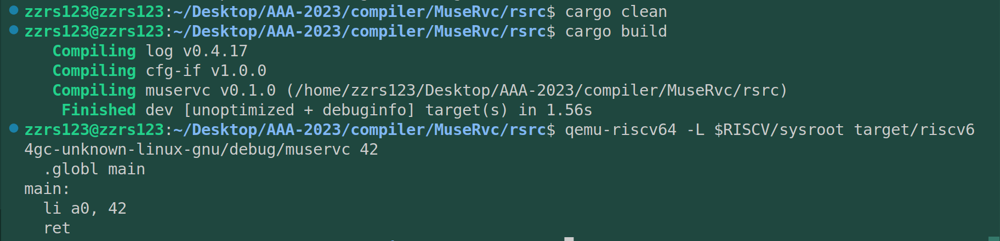

# 交叉编译

上手难点之一，需要理解Cargo包管理和编译工具与交叉编译工具之间的联系。

环境：Ubuntu20.04 + rustc 1.69.0-nightly(rust - 2021) + qemu-riscv 7.0.0

参考资料：

1. qemu-riscv 7.0.0的构建：[清华Rcore-2023S文档](https://learningos.github.io/rCore-Tutorial-Guide-2023S/0setup-devel-env.html)
2. Risc-v实验环境：[rvcc配置](https://github.com/sunshaoce/rvcc-course)

   (这里我采用的是方式2，并且是直接运行，出现了很多问题，或许方式1会更好一点)。install脚本需要执行很久，大概40分钟。
3. Cargo配置target：与Rcore不同，还是想复用rust在riscv环境下的std标准库的，所以需要配置rust-riscv工具链及其标准库。

```rust

// terminal to run

rustuptargetaddriscv64gc-unknown-linux-gnu


// .cargo/config

[build]

target="riscv64gc-unknown-linux-gnu"


# # [target.riscv64gc-unknown-none-elf]

# rustflags=[

#     "-Clink-arg=-Tsrc/linker.ld","-Cforce-frame-pointers=yes"

# ]

# [target.riscv64-unknown-linux-gnu]

#     linker="riscv64-linux-gnu-gcc"

[target.riscv64gc-unknown-linux-gnu]

linker="/home/zzrs123/riscv/bin/riscv64-unknown-linux-gnu-gcc" # hereismyldtoolpath


// /Cargo.toml


[package]

name="muservc"

version="0.1.0"

authors=["Gaoyuan Du -- zzr123 <2296704779@qq.com>"]

edition="2021"


# Seemorekeysandtheirdefinitionsathttps://doc.rust-lang.org/cargo/reference/manifest.html


[dependencies]

log="0.4"

[profile.release]

debug=true


```

   后续cargo build 编译通过后，qemu链接可执行文件还会出问题，它默认你将riscv工具链安装在root目录，实际上我放在home目录，并写入了bashrc，所以这里也需要适配。

   记得 `export RISCV=~/riscv` ，之后 `source ~/.bashrc`

==================================================

下面是我的第一个rust-riscv交叉编译执行示例：

/src中的main.rs，一个能够返回数值的rust程序。

```rust
use std::env;

fn main() {
    // 从命令行参数中获取传入的参数
    let args: Vec<String> = env::args().collect();

    // 判断传入程序的参数是否为2个，args[0]为程序名称，args[1]为传入的第一个参数
    if args.len() != 2 {
        // 异常处理，提示参数数量不对。
        // eprintln，向标准错误流输出字符串
        eprintln!("{}: invalid number of arguments", args[0]);
        // 程序返回值不为0时，表示存在错误
        std::process::exit(1);
    }

    // 声明一个全局main段，同时也是程序入口段
    println!("  .globl main");
    // main段标签
    println!("main:");
    // li为addi别名指令，加载一个立即数到寄存器中
    // 传入程序的参数为str类型，因为需要转换为需要int类型，
    // parse为将字符串类型转换为int类型的方法
    println!("  li a0, {}", args[1].parse::<i32>().unwrap());
    // ret为jalr x0, x1, 0别名指令，用于返回子程序
    println!("  ret");
}!
```


